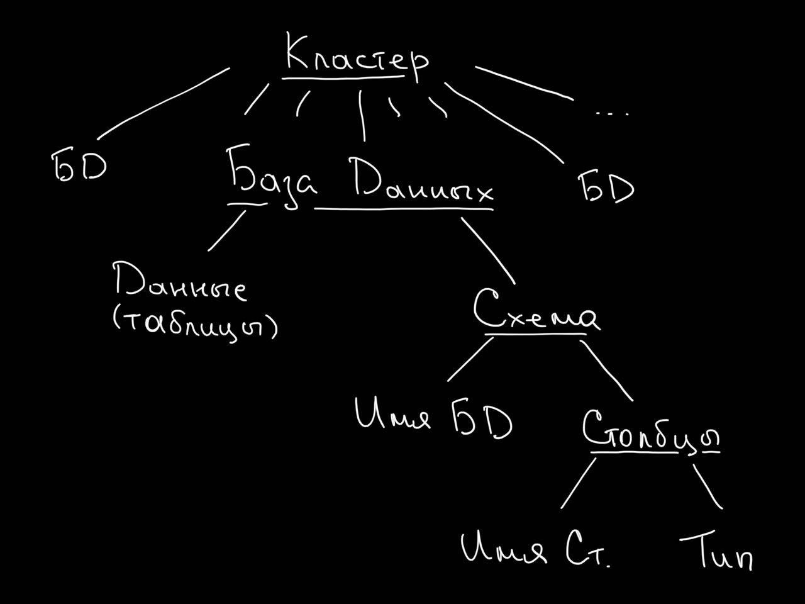
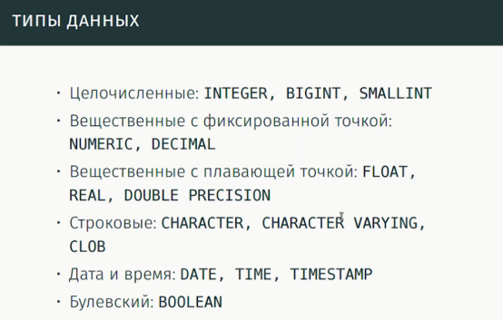

# Курс лекций по БД [Computer Science Center]

## [1. Введение в SQL](https://www.youtube.com/watch?v=_mH7c-MVUxc&list=PLlb7e2G7aSpRsPnjtSi2q0GXZdUXuXO46&index=2)

### `1:37` - Что понимается под базой данных

Для БД нужны:
- Данные
- Метаданные (названия колонок, типы хранимых данных)
- Программа

Эволюция системы хранения:
- Простое приложение и мало данных:
    - plaintext/json/XML/CSV
    - читается полностью в память
    - целиком перезаписываются при обновлении
- Два приложения, читающие данные одного формата:
    - библиотека для чтения/записи
    - рост количества данных и конкурентный доступ
    - использование примитивов синхрнизации
    - дробление данных на файлы
- Конкурентный доступ разных машин:
    - создание сервера, управляющего данными
- Сервер предоставляет пользователям модель данных и язык запросов

### `10:35` - СУБД
- появление библиотек для упрощения работы с БД

### `15:40` - реляционные СУБД
- SQLite - встроенная СУБД
 
> Реляционная СУБД - системы управления базами данных, состоящих из таблиц.

### `19:00` - сервер СУБД 
Коммерческие: Oracle, MS SQL, IBM DB2
Fee: MySQL + MariaDB, Postgres

### `27:15` - Реляционные БД

- Основной элемент - таблица

### `32:00` - Пользователи и роли

### `33:40` - Типы данных в БД

CHARACTER VARYING = VARCHAR

- Булевы есть не везде (MS)
- При создании есть инит параметры типа длины строки у VARCHAR

### `38:30` - Практика

### `51:20` - Выборки

### `55:30` - булевы

Сравнения нула с чем угодно дает нул
Проверить на нул можно используя IS NULL

### `1:04:00` - Декартово произведение

### `1:07:00` - INNER JOIN

