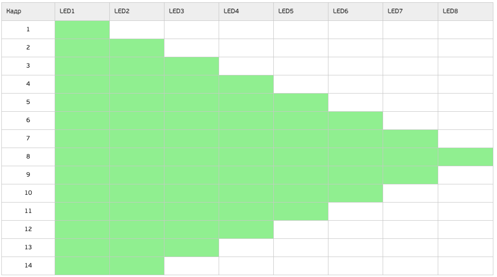
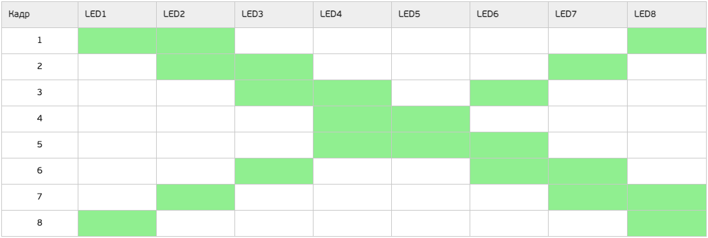

# [Курс на OpenEdu](openedu.md)

# Лабораторная работа №1

В случае установки на SW переключателях кода N (см. вариант задания) на светодиодные индикаторы `LED1...LED8` должна выводиться анимация согласно варианту задания. 
Во всех остальных случаях светодиодные индикаторы отражают значение, выставленное на SW переключателях.

По кнопке `nBTN` процессорного модуля должна осуществляться приостановка анимации. 
Одно нажатие – анимация приостанавливается, следующее нажатие – анимация продолжается с того же момента. Когда анимация не выводится на светодиоды, нажатие на кнопку игнорируется.

Состояния светодиодов процессорного модуля в процессе работы программы:

| Условие | Светодиод VD6 | Светодиод VD7 |
|:---|:---|:---|
| Вывод анимации на линейку светодиодов модуля расширения | Горит зеленым | Не горит |
|Остановка анимации по кнопке nBTN | Не горит | Горит красным |
|Режим вывода состояний SW переключателей | Не горит | Горит желтым |

N = 0x5 (16CC)

Анимация выводится циклически, то есть после вывода последнего кадра анимации она начинается сначала – с первого кадра. Время показа одного кадра – 0.5 с.

По результатам работы формируется ZIP архив, содержащий:

- исходные коды программы
- файл журнала событий, загруженного из системы после запуска программы на виртуальном стенде

В процессе работы программы должны быть проверены все возможные варианты взаимодействия пользователя со стендом.

# Лабораторная работа №2

На светодиодные индикаторы `LED1...LED8` должна выводиться анимация согласно варианту задания.

Скорость анимации задается с помощью переключателей `SW`. Если на переключателях выставлен код `0x0`, то кадры анимации меняются каждые 500 мс. С увеличением значения, выставленном на переключателях `SW` анимация замедляется на T мс. Значение T задается вариантом задания.

Например, если по варианту задано, что `T = 100 мс`, это означает, что при установке переключателей в состояние `SW = 0x1`, кадры начинают меняться каждые 500+1*100= 600 мс, если SW = 0x5, то кадры начинают меняться каждые 500+5*100 = 1000 мс и т.д.

Все задержки должны быть реализованы с использованием прерываний от базовых таймеров `TIM6` или `TIM7`.

T = 50 мс

Зеленым отмечено состояние, когда соответствующий светодиод горит. В противном случае – не горит, то есть выключен.

Анимация выводится циклически, то есть после вывода последнего кадра анимации она начинается сначала – с первого кадра.

По результатам работы формируется ZIP архив, содержащий:

- исходные коды программы
- файл журнала событий, загруженного из системы после запуска программы на виртуальном стенде