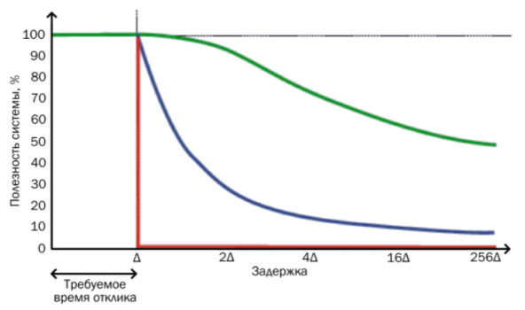
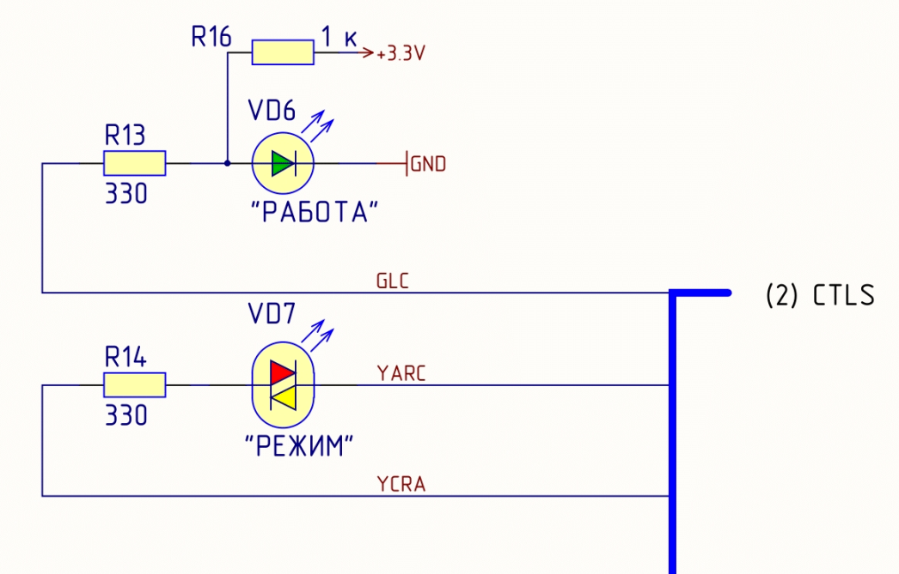
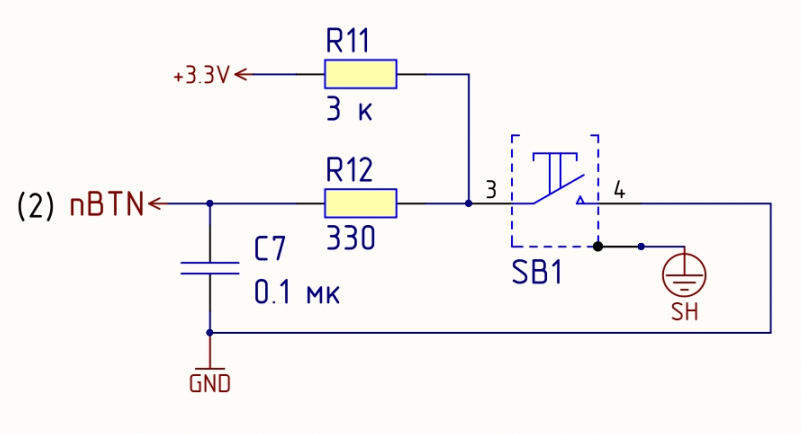

# Онлайн курс на OpenEdu

## 1. Введение

В чем состоит специфика проектирования ВсС
- [x] Встроенная система должна уметь работать с реальными объектами управления
- [x] Основная сложность заключается в том, что программная и аппаратная часть разрабатываются согласовано
- [x] Встроенная система должна отвечать высоким требованиям надежности

Операции каких систем интегрированы и контролируются вычислительным ядром в киберфизические системах
- [x] Физических, биологических, инженерных

Расположите системы в порядке возрастания степени проникновения этих систем в объект управления:
- ИУС
- ВсС
- РВсС
- КФС

Укажите цвет линии графика полезности для систем жесткого реального времени.
  

- Красный
- Для обычных систем: Зеленый

Какой смысл вкладывается в слова “во времени” в определении надежности системы?
- [x] Естественный ход времени функционирования системы, в течение которого происходит работа, техническое обслуживание, хранение и транспортирование

Дайте определение понятию “системы реального времени”:
- [x] Любая вычислительная система с гарантированным временем реакции на события
- [x] Любая вычислительная система, в которой время формирования выходного воздействия является существенным

Дайте определение понятию “безопасность системы”:

Дайте определение понятию “Встроенные вычислительные системы”:
- [x] Специализированные вычислительные системы, непосредственно взаимодействующие с объектом контроля и управления верно

Отметьте классы встроенных систем:
- [x] Системы автоматического управления (САУ)
- [x] Измерительные системы и системы сбора информации с датчиков
- [x] Системы передачи данных (коммуникационные системы)
- [x] Системы управления подвижными объектами

Выберите основные особенности встроенных систем:
- Управление реальными объектами
- Работа в реальном времени.
- Повышенное требования к надежности
- [x] Все выше перечисленные

Укажите виды систем реального времени:
- [x] Мягкого реального времени, жесткого реального времени

По мере совершенствования элементной базы происходили (выберите несколько):
- [x] Уменьшение размеров электрических схем
- [x] Снижение энергопотребление
- [x] Увеличение производительности
- [x] Увеличение объемов памяти

## 2. Встроенные системы

Производительность микроконтроллера измеряют:
- [x] В MIPS верно

Расшифруйте аббревиатуру СБИС: (в единственном числе):
- [x] Сверхбольшая интегральная схема

На каком уровне пирамиды автоматизации работают сетевые модули ввода-вывода:
- [x] Уровень оборудования функциональных узлов верно

Главным элементом какого уровня пирамиды автоматизации являются логические контроллеры?
- [x] Уровень функциональных узлов 

Соедините уровни пирамиды автоматизации с соответствующими сетями, обслуживающими данные уровни:

|Уровень автоматизации|Сеть|
|:---|:---|
| Уровень предприятия | Корпоративная сеть |
| Уровень объекта | scada-система верхнего уровня |
| Уровень подсистемы | scada-система нижнего уровня |
| Уровень функциональных узлов | Сети DeviceBus |
| Уровень оборудования функциональных узлов | Сети SA |

Выберите особенности Индустрии 3.0:
- [x] Автоматизация производства

Выберите особенности Индустрии 4.0:
- [x] Локальное использование цифровых технологий
- [x] Использование киберфизических систем

Пирамида автоматизации - это:
- [x] Модель, объединяющая все сферы деятельности современного предприятия в единую информационную среду

Микроконтроллеры по способу программирования классифицируют на:
- [x] Однократно программируемые
- [x] Перепрограммируемые

Расположите встроенные системы по уменьшению максимальной стоимости системы:
- [x] ВС, Сервер, ПК

Укажите примерный промежуток времени, в течение которого закладывалась основа встроенных систем:
- [x] 

## 3. Киберфизические системы

В чем особенности модели вычислений “конечный автомат”?
- [x] Представлена в виде ориентированного графа
- [x] Вершины графа являются состояниями

Что такое “наихудшее время выполнения”?
- [x] Максимальное время, которое требуется для выполнения процесса в данном контексте на данных вычислительных ресурсах

Расшифруйте аббревиатуру WCET:
- [x] Worst case execution time 

Чем опасна взаимная блокировка процессов? (выберите несколько вариантов ответов):
- [x] Невозможность дальнейшего исполнения заблокированных процессов
- [x] Нарушение временных ограничений на выполнение данных процессов

В чем заключаются недостатки многопоточного программирования?
- [x] Отсутствие гарантий своевременного выполнения задач
- [x] Усложнение программной реализации

Выберите особенности киберфизической системы:
- [x] Вычислительные возможности интегрированы в физические компоненты системы
- [x] Система является в высокой степени автоматизированной
- [x] При разработке системы уделяется особенное внимание соблюдению требований реального времени

Выберите примеры киберфизических систем:
- [x] Системы типа «Умный дом»

Выберите примеры целевых функций системы:
- [x] Управление двигателем автомобиля
- [x] Управление квадрокоптером
- [x] Управление стиральной машиной
- [x] Управление умным домом

В чем заключаются преимущества использования конечного автомата?
- [x] Достаточно хорошо работает при избыточных ресурсах производительности
- [x] Хорошо работает при небольшом количестве задач с небольшим количеством состояний

В чем заключаются недостатки использования конечного автомата?
- [x] Не гарантирует выполнение низкоприоритетных задач
- [x] Громоздкая реализация

Выберите определения, подходящие для понятия “модели вычислений” (одно или несколько):

Выберите подходящие определения для понятия “кибер-физические системы”:
- [x] Системы, в которых кибернетические и физические системы тесно интегрированы на всех уровнях
- [x] Физические, биологические и инженерные системы чьи операции интегрированы и контролируются вычислительным ядром

## 4. Особенности конструкции встроенных систем 

Сопоставьте обозначения температурного диапазона с его значениями:

| Стандарт | Температура |
|:---|:---:|
| C - коммерческий |  (0..70°С) |
| I - индустриальный | (-40..85°С) |
| A - автомобильный | (-40..125°С) |
| M - военный | (-55..125°С) |

УЗИП класса B:
- [x] Для защиты от прямых ударов молнии в здание, мачту, ЛЭП верно

УЗИП класса C:
- [x] Для защиты электросети от коммутационных помех, как вторая ступень защиты при ударе молнии

Укажите код самого защищенного корпуса по таблице степеней защиты IP:
- [x] IP 68 

Код IP20 - вторая цифра отвечает за:
- [x] Защиту от попадания воды

Рассеиваемая мощность корпуса - это характеристика показывающая:
- [x] Какая мощность может быть рассеяна электронным устройством внутри корпуса во время его эксплуатации

Выберите определение понятию International Protection Marking:
- [x] Международные коды защиты

Набор кодов IP - это:
- [x] Система кодификации, применяемая для обозначения степеней защиты, обеспечиваемых оболочкой, от доступа к опасным частям, попадания внешних твердых предметов, воды, а также для предоставления дополнительной информации, связанной с такой защитой. верно

Как осуществляют защиту от ударов и вибраций?
- [x] Лакирование платы
- [x] Демпферы для гашения вибрации
- [x] Дополнительные крепежи для тяжелых элементов

Что понимают под вибрацией аппаратуры?

Рассеиваемая мощность корпуса - это характеристика показывающая:
- [x] Какая мощность может быть рассеяна электронным устройством внутри корпуса во время его эксплуатации

После цифрового кода могут следовать две буквы: например, IP 68 C H. H - дополнительная буква для обозначения:
- [x] Защиты оборудования верно


## 5. Вычислительная подсистема

Фаблесс компания - это:
- [x] Модель организации бизнеса в электронной промышленности, при которой компания-производитель специализируется только на разработке и продаже микроэлектроники, но не имеет собственных производственных мощностей

Процессор общего назначения...
- [x] Предназначен для построения высокопроизводительных вычислительных устройств для обработки данных

Расшифруйте аббревиатуру ПДП: (в единственном числе)
- [x] прямой доступ к памяти

Микропроцессор - это:
- [x] Процессор в интегральном исполнении (в виде интегральной схемы)

Оконный сторожевой таймер...
- [x] Является механизмом защиты системы от сбоев
- [x] Сохраняет два значения таймера
- [x] Контролирует то, что длительность выполнения процесса не стала _больше_ определенного значения
- [x] Контролирует то, что длительность выполнения процесса не стала _меньше_ определенного значения

Процессорные ядра Cortex-A используются...
- [x] Для мультимедиа приложений и обработки данных

Процессорные ядра Cortex-M используются...
- [x] Для микроконтроллеров

Процессорные ядра Cortex-R используются...
- [x] Для систем реального времени

Выберите верные утверждения для процессорного ядра Cortex-R:
- [x] Фокус на уменьшении времени отклика
- [x] Оптимизировано для высокопроизводительных систем реального времени

Выберите верные утверждения:
- [x] Принцип действия таймера основан на изменении на 1 (в плюс или минус) исходного значения двоичного счетчика

Прерывание - это:
- [x] Прекращение работы определенной задачи с последующим возвратом к ней
- [x] Механизм межпроцессного взаимодействия

Сколько сторожевых таймеров в микроконтроллерах STM32F407:
- [x] 2

Укажите параметры передачи данных интерфейса SPI, если CPOL установлен в 1, а CPHA=0:
- [ ] Первый фронт линии синхронизации нарастающий, установка данных происходит по переднему фронту
- [ ] Первый фронт линии синхронизации нарастающий, выборка данных происходит по заднему фронту
- [ ] Первый фронт линии синхронизации падающий, выборка данных происходит по заднему фронту
- [x] Правильного ответа нет

## Тестирование по лабораторной работе №1

Что происходит при вызове функции HAL_GPIO_ReadPin(GPIOC, GPIO_PIN_15) из программы для микроконтроллера STM32F407VGT6, работающего в составе виртуального стенда:
- [x] Чтение значения кнопки nBTN на процессорном модуле
- [x] Чтение значения состояния 15-ого вывода порта С

Что происходит при вызове функции HAL_Delay(15):
- [x] Задержка выполнения программы на 15 мс

Какое количество портов ввода/вывода общего назначения в микроконтроллере STM32F407VGT6:
- [x] 5

Какой сигнал и с каким значением (логическая 1 или логический 0) включает (зажигает) желтый светодиод процессорного модуля:


- [x] YARC = 1, YCRA = 0 (скорее всего)

Какой сигнал и с каким значением (логическая 1 или логический 0) включает (зажигает) красный светодиод процессорного модуля:

- [x] YARC = 0, YCRA = 1

Что происходит при вызове функции HAL_GPIO_WritePin(GPIOD, GPIO_PIN_3, GPIO_PIN_SET) из программы для микроконтроллера STM32F407VGT6, работающего в составе виртуального стенда:
- [x] Происходит включение зеленого светодиода LED1 на модуле расширения

Какое значение сигнала будет считано на линии nBTN в случае нажатия кнопки процессорного модуля:

- [x] Логический 0

Почему целесообразно выделять HAL- слой (Hardware abstraction Layer, слой абстракции от аппаратуры) при разработке программного обеспечения для микроконтроллеров:
- [x] Для обеспечения переносимости прикладной части программного обеспечения в рамках семейства микроконтроллеров
- [x] Для сокрытия особенностей аппаратного обеспечения от прикладного программиста
- [x] Для унификации разработки программного обеспечения под семейство микроконтроллеров

Какие действия выполняет приведенная последовательность вызова функций:
```
HAL_GPIO_WritePin(GPIOD, GPIO_PIN_13, GPIO_PIN_RESET);
HAL_GPIO_WritePin(GPIOD, GPIO_PIN_14, GPIO_PIN_SET);
HAL_GPIO_WritePin(GPIOD, GPIO_PIN_15, GPIO_PIN_RESET);
```
- [x] Включает желтый светодиод процессорного модуля

Какая разрядность портов ввода/вывода общего назначения в микроконтроллере STM32F407VGT6:
- [x] 16 бит

## 6. Операционные системы реального времени 

ОС реального времени...
- [x] ориентированы на управление. 

Расшифруйте аббревиатуру IPC: (в единственном числе с маленькой буквы)
- [x] interprocess communication

Дескриптор задач - это:
- [x] индекс в таблице содержащей информацию о задачах. 

Задачи операционной системы:
- [x] организация вычислительного процесса.
- [x] выделение ресурсов для прикладных процессов.
- [x] упрощение процесса программирования.


В ядро операционной системы входят:
- [x] Переключатель задач
- [x] Планировщик
- [x] Средства управления памятью

В контекст процесса входят:
- [x] IP (Instruction Pointer).
- [x] SP (Stack Pointer).
- [x] Различные флаги ЦП.
- [x] Используемые процессом регистры общего назначения.

Под очередью задач понимают:
- [x] множество дескрипторов задач, готовых к исполнению.

Исполнительские ОС РВ - это:
- [x] класс ОС РВ, содержащих в себе только необходимые для решения целевой задачи компоненты (переключатель, планировщик, средства IPC и т.д.). верно

Какая информация о процессе содержится в таблице под номером дескриптора процесса?
- [x] Ссылка на область кода.
- [x] Ссылка на область данных.
- [x] Крайний срок окончания.

Какие варианты реализации сообщения применяются в ОП РВ?
- [x] Синхронные (с блокировкой).
- [x] Асинхронные (без блокировки).
- [x] С постоянным соединением (канал, поток). 
- [x] Без постоянного соединения.

## 7. Языки программирования

Укажите понятия стандарта IEC-61499.
- [x] Интерфейсный функциональный блок.
- [x] Субприложения.
- [x] Базовый функциональный блок.
- [x] Адаптеры.

По каким параметрам обычно осуществляют классификацию языка?
- [x] По модели вычислений
- [x] По способу записи.
- [x] По степени формализации.

Расшифруйте аббревиатуру CFB (в единственном числе).
- [x] composite function block

Расшифруйте аббревиатуру BFB (в единственном числе).
- [x] basic function block

Уровень абстракции от аппаратуры - это...
- [x] программно-реализованная платформа, скрывающая особенности реализации аппаратных средств, сделанных по разному или выпущенных разными производителями. 

Укажите понятия стандарта IEC-61131-3.
- [x] Графический язык на базе сетей Петри.
- [x] Язык функциональных блоков.

Какая модель вычислений лежит в основе языка программирования Си?
- [ ] Модель вычислений Сети процессов Кана.
- [ ] Модель вычислений Сети Петри.
- [ ] Модель вычислений Конечный автомат.
- [x] Правильного ответа нет. 

Язык программирования - это...
- [x] язык, позволяющий выразить человеческие мысли и образы в формальном виде, однозначно воспринимаемом вычислительным устройством в рамках конкретной модели вычислений. 

Характеристика языка "Простота" отвечает за...
- [x] минимум языковых конструкций. 

Синтаксис - это...
- [x] совокупность правил написания языковых элементов (лексем).

Семантика - это...
- [x] смысловое наполнение языковых конструкций. 

## 8. Отладка и тестирование

Тестирование юзабилити - это...
- [x] проверка удобства использования системы.

Выберите одно или несколько верных утверждений. Нагрузочное тестирование - это...
- [x] определение предельной нагрузки, при которой система работает правильно.
- [x] проверка работоспособности системы при нагрузках, определенных в спецификации.

Выберите одно или несколько верных утверждений. Модульное тестирование предполагает:
- [x] отдельное тестирование некоторых функций.
- [x] отдельное тестирование некоторых классов.
- [x] отдельное тестирование аппаратных частей системы.

Выберите одно или несколько верных утверждений. Стресс тестирование - это...
- [x] проверка работоспособности системы при повышенных нагрузках.

Выберите одно или несколько верных утверждений. Отладка - это...
- [x] доведение системы до работоспособного состояния.

Для чего используется логический анализатор в процессе отладки?
- [x] Для визуального наблюдения за цифровыми сигналами.

Выберите одно или несколько ключевых утверждений. Тестирование "черного ящика" - это...
- [x] тестирование на соответствие требованиям к системе без знания внутренней архитектуры системы.

Источники проблем при отладке ВсС и КФС (выберите одно или несколько утверждений).
- [x] сложность программного обеспечения.
- [x] разработка и тестирование системы проводятся на разных вычислительных устройствах.

Выберите одно или несколько верных утверждений. Регрессионное тестирование - это
- [x] проверка влияния изменений в проекте на существующую функциональность продукта.

Выберите одно или несколько верных утверждений. Отладка - это...
- [x] этап выявления ошибок, поиска и устранения (исправления) ошибочных мест.
- [x] доведение системы до работоспособного состояния.

Выберите одно или несколько верных утверждений. Функциональные требования - это...
- [x] то, что система должна делать и как реагировать на воздействия внешней среды.

## 9. Особенности компиляторов языков С/С++ для встроенных систем

Дайте определение (одно или несколько). Синтезатор...
- [x] переводит исходную программу с эквивалентную ей в рамках другой модели вычислений.
  
Дайте определение (одно или несколько). Компилятор...
- [x] переводит исходную программу с эквивалентную ей в рамках одной модели вычислений.
  
Дайте определение (одно или несколько). Линкер...
- [x] объединяет входные объектные модули в единый файл.
- [x] создает исполняемую программу из нескольких входных файлов.

Выберите верный утверждения (одно или несколько) относительно формата HEX файла. Формат содержит:
- [x] начальный адрес блока записываемых данных занимает 2 байта.
- [x] каждая строка заканчивается стандартной парой CR\LF.
- [x] каждая строка содержит байт контрольной суммы.
  
Бинарный файл - это...
- [x] готовый образ памяти системы, используется для программирования «голого» железа.
  
Выберите верный утверждения (одно или несколько) относительно формата S19. Формат содержит:
- [x] data, последовательность данных, состоящих из пар шестнадцатеричных цифр.
- [x] стартовый символ.
- [x] тип записи.
- [x] две HEX цифры, показывающие количество байтов.
- [x] две HEX цифры, показывающие количество пар шестнадцатеричных цифр.
  
Выберите верный утверждения (одно или несколько) относительно формата HEX файла. Формат содержит:
- [x] начальный адрес блока записываемых данных занимает 2 байта.
- [x] каждая строка заканчивается символами перевода строи и возврата каретки.
  
Выберите одно или несколько верных утверждений. Объектный модуль - это...
- [x] файл с промежуточным представление отдельного модуля программы.
- [x] модуль, получаемый в результате трансляции исходного кода.
  
Загрузочный модуль - это...
- [x] файл, полученный после компиляции и сборки проекта в формате, требуемом для выполнения на конкретной платформе. 
  
Основные категории секций в объектном файле - это...
- [x] исполняемый код.
- [x] данные.
- [x] неинициализированные данные.

Что такое "гонки" в контексте многопоточного программирования?
- [x] Одновременная попытка получения доступа к одному ресурсу для нескольких процессов. 

## 10. Инструментальные средства отладки и тестирования 

Какие функции выполняет микросхема FTDI FT2232D?
- [x] Позволяет через интерфейс USB управлять портами ввода/вывода общего назначения.
- [x] Преобразует интерфейс USB в интерфейс UART.
- [x] Преобразует интерфейс USB в интерфейс JTAG.

Стандартные периферийные интерфейсы - это:
- [x] Группа интерфейсов, объединяющая контроллеры ввода-вывода с процессорами ввода-вывода

JTAG предназначен для решения следующего перечня основных задач:
- [x] начальное тестирование, которое выявляет технологические дефекты изготовления.
- [x] программирование микроконтроллеров.
- [x] отладка с пошаговым исполнением.
  
Укажите возможности отладчика в составе инструментальных средств разработки ПО для микроконтроллеров.
- [x] Просмотр содержимого внутренних регистров и памяти.
- [x] Работа с точками останова.
- [x] Пошаговая отладка.
  
В чем принципиальное отличие логического анализатора от осциллографа?
- [x] Имеет, как правило, больше каналов, чем осциллограф.
- [x] В отличие от осциллографа предназначен для наблюдения только за цифровыми сигналами.
  
Отладчик — это...
- [x] набор инструментов, с помощью которых выполняется поиск ошибок во время тестирования целевой системы. верно
  
Целевая система — это...
- [x] вычислительная система, решающая прикладную задачу.
  
Для чего используется OpenOCD?
- [x] Используется для связи отладочных адаптеров разных типов и программы отладчика на базе GNU GDB.
  
Для чего используется логический анализатор в процессе отладки?
- [x] Для визуального наблюдения за цифровыми сигналами.
  
Укажите достоинства применения SWD по сравнению с интерфейсом JTAG.
- [x] Контроль четности при передаче данных.
- [x] Может работать на более высоких скоростях.
  
Выберите основные особенности стандарта IEEE 1149.1 JTAG.
- [x] Возможность параллельной согласованной работы нескольких устройств, поддерживающих данный стандарт.
- [x] Возможность расширения системы команд и форматов данных для отладочного интерфейса.
  


