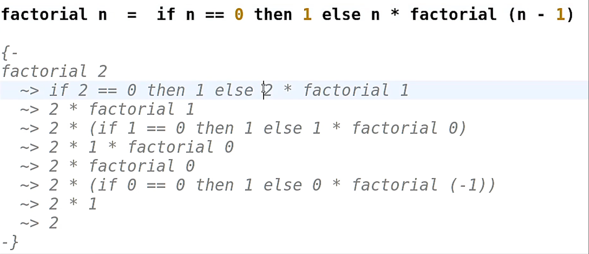
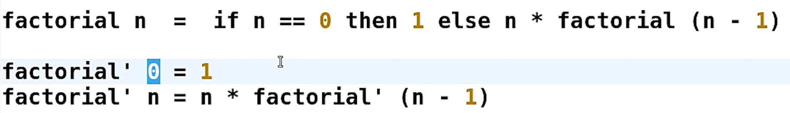

## 1.2 Функции
### Модели вычисления

В императивных языках программа - последовательность инструкций. 
Подразумевается, что есть некий вычислитель, который принимает эти инструкции и последовательно их исполняет.
Результаты таких инструкций сохраняются в ячейках памяти. 

**Переменные** (в имп. языках) - ячейки, данные в которых могут изменяться.

В функциональных языках программа представляет собой некоторое выражение. 
Исполнение представляет собой последовательных редукциях этих выражений до тех пор, пока редукция не станет невозможна.
Редуцированное выражение представляет собой результат работы программы. 

Пример:
```
(2 + 5 * 3) ^ 2
-> (2 + 15) ^ 2
-> (17) ^ 2
-> 289 - finish
```

### Функции

> Функция N переменных может быть представлена как функция одной переменной, возвращающая функцию N-1 переменной.

Чистая функция - значение функции полностью определяется значением ее аргументов. Никакие внешние данные не влияют на отдаваемое значение.

Свойство: функция, не принимающая ни одного аргумента - константа.

### Условное выражение  `if ... then ... else ...`

Пример:
```
f x = if x > 0 then 1 else (-1)
```

Обе ветки условия должны существовать

Все операторы в Haskell бинарные, за исключением унарного минуса.

Операторы можно вызывать в (функциональном) стиле, функции можно вызывать в \`инфиксном стиле\`

### Приоритет операторов 

Приоритет в Хаскиле есть число от 0 до 9, за исключением функций - у них 10 - самый высокий.

### Ассоциативность

Оператор вычитания левоассоциативен.

## 1.5 Рекурсия

### Рекурсивное определение функции

Требование к рекурсивной функции:
1. Вызовы функции в правой части должны осуществляться на значениях параметра отличного от формального параметра функции
2. Рекурсивные вызовы должны где-то прерываться (Наличие терминирующего условия)

Вычисления происходят путем подстановки тела функции с заменой формального параметра на фактический 




### Сопоставление с образцом

Замена if .. then .. else



Задача 1

Определите функцию, вычисляющую двойной факториал, то есть произведение натуральных чисел, не превосходящих заданного числа и имеющих ту же четность. Например:  7!! = 7 ⋅ 5 ⋅ 3 ⋅ 1,  8!! = 8 ⋅ 6 ⋅ 4 ⋅ 2. Предполагается, что аргумент функции может принимать только неотрицательные значения.
```
doubleFact :: Integer -> Integer
doubleFact 0 = 1
doubleFact 1 = 1
doubleFact n = n * doubleFact (n - 2)
```

### Незавершающиеся программы и ошибки

### Охранные выражения

Задача 2


Задача 3

### Рекурсия с явным аккумулятором

Задача 4

