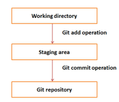

# Лабораторная работа 2: 

1. Системы контроля версий - назначение, примеры решений.
2. Ревизии и ветки.
3. Основные операции над данными в системах контроля версий. Основные команды svn и git.
4. Виды конфликтов и способы их решения.

# Трофейные вопросы:

## Индексация изменений в git и svn

## Каким конкретно образом работают коммиты?


`git status -s`, `svn status` - какие файлы менялись, до/после добавления.

Пример вывода (Git):
```
On branch main -> на какой ветке находимся
Your branch is ahead of 'origin/main' by 4 commits. -> локальная ветка репо на 4 коммита опережает удаленный репо
  (use "git push" to publish your local commits)

Changes not staged for commit:
        modified:   MISPI/lab2.md -> измененные файлы

```

Об отслеживании изменений в репозитории:

- **Git** делает снимок репо. После каждого изменения в репо чекает изменение каждого файла.
- **SVN** отслеживает не файлы, а их действия над файлами,
то есть смотрит не на внутреннее состояние, а на факт модификации.

`git reset` - отмена индексаций на текущем коммите. 
Можно применить к отдельным файлам для отмены слежки до коммита

## Возвращение к некоторой ревизии в git и svn

SVN:
```
svn checkout -r 5 file:///home/s283904/soc/svn_repos/svnrep/trunk
svn update -r r4
```
Где `-r` номер коммита (ревизии)

Git:
```
git log # смотрим hash коммита
нужно создать отдельную ветку и туда перекочевать
git checkout -b brnch "hash"
```

## `svn commit -a` - значение флага

Такого нет. 

Есть `-A`: еще не добавил, но планируешь добавить этот файл (скорее для себя)

`git commit -a` : все модифицированные файлы добавляются в коммит автоматически

## Контроль merge в git и svn

svn: `ignore-conflict` :)

Полезные ключи:
- `git merge <ветка> --squash` - объединит изменения всех коммитов 
  <ветка>, перенесет их в ветку, в которой находитесь, и добавит в индекс. 
  При этом коммит слияния не будет создан, вам нужно 
  будет сделать его вручную.
 
```
master:   A - B - C - D - Sq
                   \ 
feature:            X - Y
```

Позже, в случае выполнения «классического» git merge feature 
можно исправить это. Тогда история примет следующий вид:
```
master: A - B - C - D - Sq - (M)
                 \           /
feature:          X    -    Y
```

- Чтобы сравнить результат слияния с тем, что было в вашей ветке до слияния, 
  или другими словами увидеть, что привнесло данное слияние, вы можете 
  выполнить `git diff --ours`

[Еще приколы с `git merge`](https://habr.com/ru/post/195674/)

Конфликты, как правило, нельзя принять механически. Нужно открывать и смотреть. 
Можно вызывать diff, но он обычно не поможет.

- Git и SVN после неудачной попытки merge говорят в каких файлах проблемы:
    - Тогда нужно выбрать какие изменения применять, открыв в текстовом редакторе файлы, выполнить `git/svn add <file>` и закоммитить
    - SVN создает по такому случаю три файла:
      `.mine` - который у тебя, 
      `.OLDREV` - который был в ветке, 
      `.NEWREV` - который хочешь туда закинуть
- Если же вместо ручного разрешения конфликта вы хотите, чтобы Git просто 
  использовал какую-то определённую версию файла, а другую игнорировал, 
  то вы можете передать команде merge одну из двух опций `-Xours` или `-Xtheirs`.
- Можно сконфигурировать git репозиторий всегда отдавать приоритет при слиянии какой-то ветке

[Продвинутое слияние](https://git-scm.com/book/ru/v2/%D0%98%D0%BD%D1%81%D1%82%D1%80%D1%83%D0%BC%D0%B5%D0%BD%D1%82%D1%8B-Git-%D0%9F%D1%80%D0%BE%D0%B4%D0%B2%D0%B8%D0%BD%D1%83%D1%82%D0%BE%D0%B5-%D1%81%D0%BB%D0%B8%D1%8F%D0%BD%D0%B8%D0%B5)

## Как перенести правки из одной ветки в другую
  
Перенести правки из одной ветки в другую: 

- Сохранить правки: `git rebase`

- Перейти не сохранив правки: `git cherry-pick` + commit

## Коммит merge должен быть в одном, а не три
  
Нужно объединить на 1 ветке 2 коммита. 
1 ветка файл А с коммитом А, файл Б с коммитом Б. на 2 ветке файл С с коммитом С.
ЧП на 2 ветку 
`git cherry-pick`

## Области видимости в git config - попрактиковаться

- _Global_: Файл `[path]/etc/gitconfig` содержит значения, общие для всех пользователей системы и для всех их репозиториев. 
Если при запуске git config указать параметр --system, то параметры будут читаться и сохраняться именно в этот файл.

- _User_: Файл `~/.gitconfig` или `~/.config/git/config` хранит настройки конкретного пользователя. 
Этот файл используется при указании параметра --global.

- _Repo_: Файл config в каталоге Git (т. е. `.git/config`) репозитория, который вы используете в данный момент, 
хранит настройки конкретного репозитория. 
Вы можете заставить Git читать и писать в этот файл с помощью параметра --local, но на самом деле это значение по умолчанию.
  

  В `username`, `email`, `password` задаются для юзера, который пушит коммиты.

  `upsteam` для репозитория в случае, если ветки нет в основном репо, то при создании ветки локально, она будет нормально пушиться.


## Git rebase

Х%йня еб%ная. Пидорская


## Получение изменений


`git clone`: Копирование удаленного репозитория.

Инициализируется пустой репозиторий. 
Из ветки, которая в конфиге указана, автоматически происходит выгрузка.

`git fetch`: Получение обновлений

Команда `git fetch` связывается с удалённым репозиторием и забирает из него все изменения, 
которых у вас пока нет и сохраняет их локально.


`git pull`: Обновление существующего репозитория.

Команда `git pull` работает как комбинация команд `git fetch` и `git merge`, т. е. 
Git вначале забирает изменения из указанного удалённого репозитория, а затем пытается слить их с текущей веткой.

В зависимости от того, какая ветка и какой конфиг. Можно настроить стандартную ветку для `pull`. 
Если разработчик работал только в одной ветке и она никому не нужна, то имеет смысл настроить `pull` на `master`, 
чтобы для всех выкачивалась основная ветка. 

`git push`: Выгрузка на сервер

Команда `git push` используется для установления связи с удалённым репозиторием, вычисления локальных изменений 
отсутствующих в нём, и собственно их передачи в вышеупомянутый репозиторий. 
Этой команде нужно **право на запись** в репозиторий, поэтому она использует аутентификацию.

## Стратегии слияния

У команды `git merge` есть интересный параметр, `--strategy`, стратегия. 
Git поддерживает следующие стратегии слияния:
- resolve
- recursive
- ours 
- octopus
- subtree

[Читать](https://habr.com/ru/post/195674/)

## Как внести изменения в merge commit
 
###Как в принципе изменить коммит?

Дока: [Изменение истории проекта](https://git-scm.com/book/ru/v2/%D0%98%D0%BD%D1%81%D1%82%D1%80%D1%83%D0%BC%D0%B5%D0%BD%D1%82%D1%8B-Git-%D0%98%D1%81%D0%BF%D1%80%D0%B0%D0%B2%D0%BB%D0%B5%D0%BD%D0%B8%D0%B5-%D0%B8%D1%81%D1%82%D0%BE%D1%80%D0%B8%D0%B8)

1. Если вы уже изменили какие-либо файлы, то сначала нужно спрятать изменения. Для этого выполняем команду:
```
git stash
```
2. Посмотрим список коммитов:
```
git log --oneline
```
3. Выполняем команду `git rebase -i` и указываем ей коммит, который мы хотим изменить. 
В данном случае мы хотим изменить третий коммит (относительно `HEAD`).
```
git rebase -i HEAD~3
```
4. Откроется текстовый редактор со списком коммитов. Измените слово `pick` на `edit` (или просто на букву e) у коммита, 
   который вы хотите изменить.

5. Сохраните изменения в файле. Вы снова окажетесь в командной строке.

6. Теперь внесите те изменения, которые вы хотели сделать с файлами. Если вы на первом шаге спрятали эти изменения, то сейчас их можно снова извлечь:
```
git stash pop
```
Или же просто отредактируйте файлы.

7. Добавьте отредактированные файлы в индекс:
```
git add myfile1 myfile2
```
8. Применим наши изменения к коммиту:
```
git commit --amend --no-edit
```
9. Завершим процесс ребейза:
```
git rebase --continue
```
Если все пройдет успешно, то появится сообщение вида:
``` 
Successfully rebased and updated refs/heads/master.
```

### Как изменить несколько коммитов сразу?


1. Предположим, что нам нужно внести изменения сразу в несколько коммитов.
2. Выполняем последовательность действий, описанную выше, но на шаге 4 нужно указать несколько коммитов, которые вы хотите изменить. Для этого нужно изменить слово pick на edit сразу у нескольких коммитов в списке.
3. После сохранения файла (шаг 5) вы переключитесь на первый коммит (который старее), который вы пометили для редактирования.
4. Выполните для него шаги с 6 по 8. После этого вы переключитесь на следующий коммит, который вы пометили для редактирования. И так далее.

`stash`: поместить текущие изменения, которые вы выполнили в файлах, в отдельное хранилище, и вернуть файлы к исходному состоянию.
То есть `git stash` прячет изменения в файлах и сохраняет эти изменения отдельно, чтобы **потом можно было их вернуть**.
- `git stash save "Сообщение для сташа"`: делает то же самое, но можно добавить сообщение
   - Флаг `--include-untracked` или `-u`: спрятать не добавленные в репо файлы
- `git stash apply`: берет самое свежее прятание и применяет его в репо
   - Параметр `git stash apply stash@{1}`: применить конкретное прятание

_Пример_:
Вы выполнили какие-нибудь изменения в файлах и хотите переключиться на другую ветку, но чтобы там не было ваших
текущих изменений. С помощью команды `git stash` можно спрятать эти изменения. Ваши изменения помещаются в
отдельное хранилище — в стек, а вы можете спокойно переключиться на другую ветку.
Всё, что вы прячете с помощью `git stash`, попадает в отдельный список. Затем вы можете извлекать оттуда то, что вы туда
спрятали — ваши «прятанья».

[Подробнее про `git stash`](https://pingvinus.ru/git/1718)


## Как откатить файл до определённой ревизии

git checkout <commit_hash> --file_name

svn revert

## .gitignore для вложенности

[Дока](https://git-scm.com/docs/gitignore)

Все вложенных файлов:

- A leading " ** " followed by a slash means match in all directories. 
For example, "**/foo" matches file or directory "foo" anywhere, the 
same as pattern "foo". "**/foo/bar" matches file or directory "bar" 
anywhere that is directly under directory "foo".
- A trailing "/**" matches everything inside. 
For example, "abc/**" matches all files inside directory 
"abc", relative to the location of the .gitignore file, 
with infinite depth.
- A slash followed by two consecutive asterisks then a 
  slash matches zero or more directories. For example, 
  "a/**/b" matches "a/b", "a/x/b", "a/x/y/b" and so on.

## Удалить не слитую ветку?

[`git branch`](https://git-scm.com/docs/git-branch)

- `-d` `--delete` :
Delete a branch. The branch must be fully merged in its upstream branch, or in HEAD if no upstream was set with --track or --set-upstream-to.

- `-D` :
Shortcut for `--delete --force`.
  
- `-f` `--force` :
Reset `<branchname>` to `<startpoint>`, even if `<branchname>` exists 
already. Without `-f`, git branch refuses to change an existing branch. 
In combination with `-d`, allow deleting the branch 
irrespective of its merged status. In combination with `-m` (or `--move`), 
allow renaming the branch even if the new branch name already exists, 
the same applies for `-c` (or `--copy`).

## Стратегии мержа (Git / SVN)

[Git](https://www.simplilearn.com/tutorials/git-tutorial/merge-conflicts-in-git):


Способ 1: В лоб
1. После конфликта изменить все файлы 
2. `git add <измененные файлы>` 
3. `git commit -m "resolved conflict"`

Способ 2:
он точно существует. Скорее всего через `git diff`

SVN:
```
svn resolve <список_файлов>
svn commit
```

## Изменить состояние файлов на соответствующее какому-то коммиту

1. Идём в `git log` ищем хэш, который мы хотим
2. `git branch -b <новая_ветка> <Hash_который_хотим>`
3. И ты откатишь все файлы

