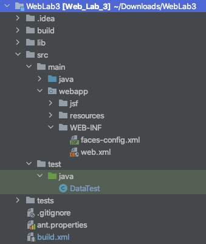

# Лабораторная работа 3:

1. Тестирование ПО. Цель тестирования, виды тестирования.
2. Модульное тестирование, основные принципы и используемые подходы.
3. Пакет JUnit, основные API.
4. Системы автоматической сборки. Назначение, принципы работы, примеры систем.
5. Утилита make. Make-файлы, цели и правила.
6. Утилита Ant. Сценарии сборки, цели и команды.

## Некоторые гайд-лайны

Покид А. требует собирать проект в `.jar`, а Усков И. в `.war`.

Примеры:

Для веб-приложения со структурой:



Для использования отдельного файла настроек в Ant, нужно написать:

```xml
<loadproperties srcfile="ant.properties" />
```

Конфигурационный файл `ant.proporties`:

```make
name=Web3 -> Имя проекта
src=./src -> Директория с Java исходниками
main=${src}/main
out=./out -> Директория с собранным проектом
```

Сборка проекта `build.xml`:

```xml
<war destfile="${out}/${ant.project.name}.war" webxml="${main}/webapp/WEB-INF/web.xml">
    <classes dir="${classes}"/>
    <lib dir="${lib}"/>
    <fileset dir="${main}/webapp/"/>
    <manifest>
        <attribute name="Created-By" value="Web"/>
        <attribute name="Manifest-Version" value="1.0"/>
        <attribute name="Main-Class" value="NoClass"/>
    </manifest>
</war>
```

# Примеры некоторых целей

`compile`, `build`, `clean`, `test` предлагается сделать самостоятельно.

TODO: разрабраться как работает

**native2ascii** - преобразование native2ascii для копий файлов локализации
(для тестирования сценария все строковые параметры необходимо вынести из классов в файлы локализации):

```xml
<target name="native2ascii">
    <native2ascii src="localization" dest="build" ext=".properties"/>
</target>
```

**team** - осуществляет получение из git-репозитория 3 предыдущих ревизий, их сборку (по аналогии с основной) и упаковку
получившихся jar-файлов в zip-архив. Сборку реализовать посредством вызова цели build.

**team** - то же для svn

```xml
<target name="team">
    <echo>Making dir</echo>
    <mkdir dir="${ws.dir}"/>
    <!--    TODO: что такое fileset-->
    <fileset dir="${war.dir}"/>

    <!--    Запускаем команду 'svn update &#45;&#45;revision COMMITTED *' -->
    <exec executable="svn"
          dir="/Users/username/svn/web_3_local">
        <arg value="update"/>
        <arg value="--revision COMMITTED *"/>
    </exec>
    <!--    Собираем эту ревизию -->
    <antcall target="build"/>
    <!--    Копируем собранный проект во временную директорию -->
    <copy file="${build.dir}/${ant.project.name}.war"
          tofile="svn/${ant.project.name}v1.war"
          overwrite="false">
    </copy>

    <exec executable="svn"
          dir="/Users/username/svn/web_3_local">
        <arg value="update"/>
        <arg value="--revision COMMITTED - 1 *"/>
    </exec>
    <antcall target="build"/>
    <copy file="${build.dir}/${ant.project.name}.war"
          tofile="svn/${ant.project.name}v2.war"
          overwrite="false">
    </copy>

    <exec executable="svn"
          dir="/Users/username/svn/web_3_local">
        <arg value="updeate"/>
        <arg value="-r COMMITTED - 2 *"/>
    </exec>
    <antcall target="build"/>
    <copy file="${build.dir}/${ant.project.name}.war"
          tofile="svn/${ant.project.name}v3.war"
          overwrite="false">
    </copy>
    <!--    Архивируем все -->
    <zip destfile="${build.dir}/team.zip"
         basedir="${ws.dir}"/>
</target>
```

**report** - в случае успешного прохождения тестов сохраняет отчет junit в формате xml, добавляет его в репозиторий svn и выполняет commit.
```xml
report=./report
build=./build
classes=${build}/classes
dt=${report}/TEST-DataTest.xml
jf=${report}/junit-noframes.html
testName=DataTest

<target name="report" depends="build">
    <mkdir dir="${report}"/>
    
    <echo>Start Testing</echo>
    <junit haltonfailure="yes" printsummary="yes">
        <classpath>
            <pathelement path="${classes}"/>
            <path refid="build-path"/>
            <pathelement location="${tests}"/>
        </classpath>
        <formatter type="xml"/>
        <test name="DataTest" todir="${report}"/>
    </junit>
    
    <echo>Start report</echo>
    <junitreport todir="${report}">
        <fileset dir="${report}">
            <include name="TEST-*.xml"/>
        </fileset>
        <report format="noframes" todir="${report}"/>
    </junitreport>
    <echo>End report</echo>
    
    <delete file="${dt}"/>
    <delete file="${jf}"/>
    <echo>Git add</echo>
    <exec executable="git">
        <arg value="add"/>
        <arg value="${report}/*"/>
    </exec>
    <echo>Git commit</echo>
    <exec executable="git">
        <arg value="commit"/>
        <arg value="-m"/>
        <arg value="MISPI 3"/>
    </exec>
</target>
```

**music** - воспроизведение музыки по завершению сборки (цель build).
```xml
<target name="music" depends="build" description="Play music when build">
    <echo>Playing music</echo>
    <sound>
        <success source="${music}/Success.wav"/>
        <fail source="${music}/Fail.wav"/>
    </sound>
</target>
```
**alt** - создаёт альтернативную версию программы с измененными именами переменных и классов (используя задание 
`replace/replaceregexp` в файлах параметров) и упаковывает её в jar-архив. Для создания jar-архива использует 
цель `build`.

**doc** - добавление в MANIFEST.MF MD5 и SHA-1 файлов проекта, а также генерация и добавление в архив 
javadoc по всем классам проекта.

**xml** - валидация всех xml-файлов в проекте.

**diff** - осуществляет проверку состояния рабочей копии, и, если изменения касаются классов, указанных в файле 
параметров выполняет commit в репозиторий git.

**scp** - перемещение собранного проекта по scp на выбранный сервер по завершению сборки. 
Предварительно необходимо выполнить сборку проекта (цель `build`)

**env** - осуществляет сборку и запуск программы в альтернативных окружениях; 
окружение задается версией java и набором аргументов виртуальной машины в файле параметров.

**history** - если проект не удаётся скомпилировать (цель `compile`), загружается предыдущая версия из репозитория git.
Операция повторяется до тех пор, пока проект не удастся собрать, либо не будет получена самая первая ревизия из репозитория. 
Если такая ревизия найдена, то формируется файл, содержащий результат операции diff для всех файлов, измененных 
в ревизии, следующей непосредственно за последней работающей.


# Трофейные вопросы

## Можно ли с помощью Ant собрать НЕ Java проект

## Аннотации `@Before` и `@BeforeClass`

`@BeforeClass` используется когда несколько тестов должны использовать один и тот же дорогостоящий код установки.
Установление соединения с базой данных попадает в эту категорию. Вы можете переместить код из `@BeforeClass `
в `@Before`, но ваш тестовый запуск может занять больше времени. Обратите внимание, что помеченный код
`@BeforeClass` запускается как статический инициализатор, поэтому он будет выполняться до создания экземпляра класса
вашего тестового устройства.

В JUnit 5 теги `@BeforeEach` и `@BeforeAll` являются эквивалентами `@Before` и `@BeforeClass` в JUnit 4. Их имена
немного более показательны, когда они выполняются, в некоторой степени интерпретируются:
«перед каждым тестом» и «один раз перед всеми тестами».

## Test Driving Development

## CI/CD

### Что это такое?

### Какие есть инструменты в жизни для этого?

### На каком этапе запускаются тесты?

### Когда система CI понимает, что что-то изменилось в проекте?

## Jenkins

## Stub и Mock: в чем разница

## Make Phony

## Минусы Make

[Хабр](https://habr.com/ru/post/138682/)

- синтаксис — табуляция
- опечатки не отлавливаются и не считаются ошибками
- тяжело поддерживать сборки больших проектов
- необходимость указывания зависимостей для каждой цели
- переменные окружения могут неожиданно влиять на код вашего makefile’а. 
  Вы не можете знать наверняка, какие переменные могли быть установлены пользователем, 
  поэтому, для надёжности, вы должны инициализировать все переменные до ссылки на них или добавления через +=


## Альфа и Бета-тестирование

- это прежде всего UI/UX тестирование

## Ситуация: программа генерирует рандомные токены. Как такое тестировать?

## Когда тестировать не нужно?

А даже вредно

## Maven VS Ant VS Gradle

Если в Apache Ant нужно процедурно прописывать  

| Apache Ant | Maven | Gradle |
|:---|:---|:---|
|➖ ant build быстро разрастается|||
|legacy проекты на ant тяжело поддерживать из-за большого ant билда| | |
| |➕| |
[Видео](https://www.youtube.com/watch?v=YRUn2yd1iQk)

### Есть проект. Когда использовать тот или иной сборщик?

### Пакет JUnit, основные API

- [`junit.Assert`](https://junit.org/junit4/javadoc/4.12/org/junit/Assert.html) - 
  с помощью определенных методов проверяет соответствие ожидаемому результату
    - `assertTrue`
    - `assertFalse`
    - `assertEquals`
    - `assertNotEquals`
- [`junit.Test`](https://junit.org/junit4/javadoc/4.12/org/junit/Test.html) -
  Аннотирование JUnit
    - Основные: `@Test`, `@BeforeEach`, `@AfterEach`, `@BeforeAll`, `@AfterAll`
    - [Все](https://junit.org/junit5/docs/current/user-guide/#writing-tests-annotations) 
- [`junit.runners.Suite`](https://junit.org/junit4/javadoc/4.13/org/junit/runners/Suite.html) -
  Using Suite as a runner allows you to manually build a suite containing tests from many classes.
- [`junit.runner.Result`](https://junit.org/junit4/javadoc/4.12/org/junit/runner/Result.html) - 
  собирает информацию с множественных тестов. Успешные тесты записываются только в количество успешных тестов. Остальные что-то говорят.
- [`junit.runner.Runner`](http://junit.sourceforge.net/javadoc/org/junit/runner/Runner.html) -
A Runner runs tests and notifies a RunNotifier of significant events as it does so.
- [`junit.framework.TestCase`](http://junit.sourceforge.net/junit3.8.1/javadoc/junit/framework/TestCase.html) (JUnit3.8) -
A test case defines the fixture to run multiple tests. To define a test case
    - implement a subclass of `TestCase`
    - define instance variables that store the state of the fixture
    - initialize the fixture state by overriding `setUp`
    - clean-up after a test by overriding `tearDown`.
    Each test runs in its own fixture so there can be no side effects among test runs.