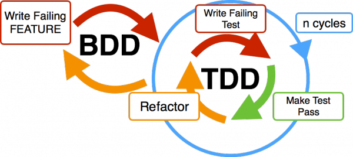
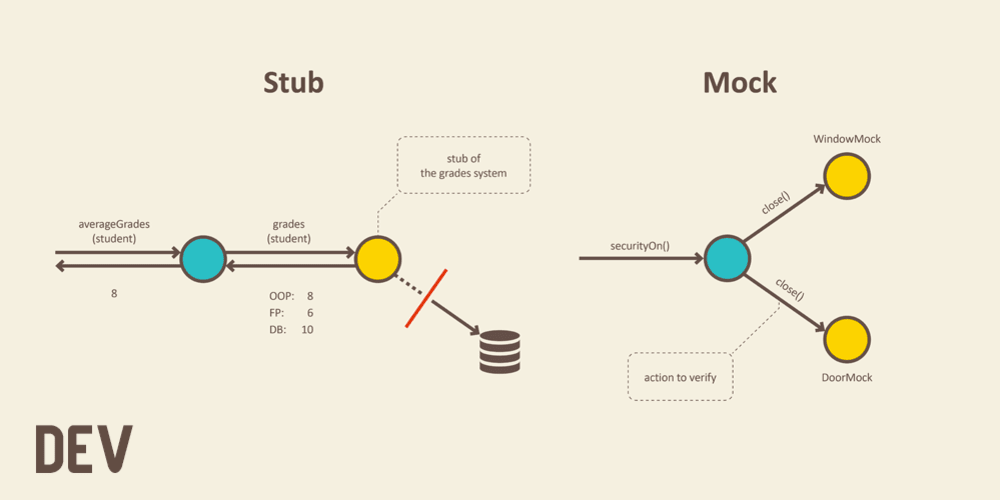

# Лабораторная работа 3:

1. Тестирование ПО. Цель тестирования, виды тестирования.
2. Модульное тестирование, основные принципы и используемые подходы.
3. Пакет JUnit, основные API.
4. Системы автоматической сборки. Назначение, принципы работы, примеры систем.
5. Утилита make. Make-файлы, цели и правила.
6. Утилита Ant. Сценарии сборки, цели и команды.

## Некоторые гайд-лайны

Крутая [статья](https://habr.com/ru/post/549054/) про фундаментальные основы тестирования.

В отчет нужна исходная область из 3-ей лабы.

Покид А. требует собирать проект в `.jar`, а Усков И. в `.war`.
Почему логичнее собирать war? Потому что это пример более приближенный к реальности. Мы собираем полноценное 
веб-приложение, но тестируем у него отдельный класс, ответственный только за что-то одно (в данном случае проверки 
принадлежности точки к области). 

Если мы собираем war-ник, то у нас в манифесте `<attribute name="Main-Class" value="NoClass"/>` 
нет точки входа в программу, потому что жизненным циклом приложения
занимается web-контейнер. Jar-ник подразумевает консольное исполнение в данном случае.

Примеры:

Для веб-приложения со структурой:


Для использования отдельного файла настроек в Ant, нужно написать:

```xml
<loadproperties srcfile="ant.properties" />
```

Конфигурационный файл `ant.proporties`:

```ant
name=Web3 -> Имя проекта
src=./src -> Директория с Java исходниками
main=${src}/main
out=./out -> Директория с собранным проектом
```
[Подробнее про проперти и отдельный файл](https://ant.apache.org/manual/Tasks/property.html

Сборка проекта `build.xml`:

```xml
<war destfile="${out}/${ant.project.name}.war" webxml="${main}/webapp/WEB-INF/web.xml">
    <classes dir="${classes}"/>
    <lib dir="${lib}"/>
    <fileset dir="${main}/webapp/"/>
    <manifest>
        <attribute name="Created-By" value="Web"/>
        <attribute name="Manifest-Version" value="1.0"/>
        <attribute name="Main-Class" value="NoClass"/>
    </manifest>
</war>
```

# Юзфул Ant таски и бэйсик юсадж

Что-то стандартное:
- [Echo](https://ant.apache.org/manual/Tasks/echo.html) - вывод сообщения
- [Copy](https://ant.apache.org/manual/Tasks/copy.html) - простое копирование файла или ресурса в файл или директорию
- [Exec](https://ant.apache.org/manual/Tasks/exec.html) - можно дать выполнить любую системную команду
- [Delete](https://ant.apache.org/manual/Tasks/delete.html) - удаление чего-нибудь
- [Mkdir](https://ant.apache.org/manual/Tasks/mkdir.html) - создать директорию
- [Native2Ascii](https://ant.apache.org/manual/Tasks/native2ascii.html) - Converts files from native encodings to ASCII with escaped Unicode. A common usage is to convert source files maintained in a native operating system encoding, to ASCII prior to compilation.
- [Zip](https://ant.apache.org/manual/Tasks/zip.html) - сжатие в архив

Что-то антовое:
- [AntCall](https://ant.apache.org/manual/Tasks/antcall.html) - вызвать другой таргет анта
- [LoadProperties](https://ant.apache.org/manual/Tasks/loadproperties.html) - загрузить пропсы из файла
- [Jar](https://ant.apache.org/manual/Tasks/jar.html) - непосредственно сборка в jar. **Стоит внимательно прочитать доку**
- [War](https://ant.apache.org/manual/Tasks/war.html) - сборка веб приложения (по сути надстройка над jar)

Что-то джавовое:
- [Java](https://ant.apache.org/manual/Tasks/java.html) - запуск java приложения
- [javac](https://ant.apache.org/manual/Tasks/javac.html) - непосредственно компиляция
- [Javadoc](https://ant.apache.org/manual/Tasks/javadoc.html) - генерация документации проекта по javadoc'у
- [javac]()

# Примеры некоторых целей

`compile`, `build`, `clean`, `test` предлагается сделать самостоятельно.

[comment]: <> (TODO: разрабраться как работает native2ascii)

**native2ascii** - преобразование native2ascii для копий файлов локализации
(для тестирования сценария все строковые параметры необходимо вынести из классов в файлы локализации):

```xml
<target name="native2ascii">
    <native2ascii src="localization" dest="build" ext=".properties"/>
</target>
```

**team** - осуществляет получение из git-репозитория 3 предыдущих ревизий, их сборку (по аналогии с основной) и упаковку
получившихся jar-файлов в zip-архив. Сборку реализовать посредством вызова цели build.

**team** - то же для svn

```xml
<target name="team">
    <echo>Making dir</echo>
    <mkdir dir="${ws.dir}"/>
    <!--    TODO: что такое fileset-->
    <fileset dir="${war.dir}"/>

    <!--    Запускаем команду 'svn update &#45;&#45;revision COMMITTED *' -->
    <exec executable="svn"
          dir="/Users/username/svn/web_3_local">
        <arg value="update"/>
        <arg value="--revision COMMITTED *"/>
    </exec>
    <!--    Собираем эту ревизию -->
    <antcall target="build"/>
    <!--    Копируем собранный проект во временную директорию -->
    <copy file="${build.dir}/${ant.project.name}.war"
          tofile="svn/${ant.project.name}v1.war"
          overwrite="false">
    </copy>

    <exec executable="svn"
          dir="/Users/username/svn/web_3_local">
        <arg value="update"/>
        <arg value="--revision COMMITTED - 1 *"/>
    </exec>
    <antcall target="build"/>
    <copy file="${build.dir}/${ant.project.name}.war"
          tofile="svn/${ant.project.name}v2.war"
          overwrite="false">
    </copy>

    <exec executable="svn"
          dir="/Users/username/svn/web_3_local">
        <arg value="updeate"/>
        <arg value="-r COMMITTED - 2 *"/>
    </exec>
    <antcall target="build"/>
    <copy file="${build.dir}/${ant.project.name}.war"
          tofile="svn/${ant.project.name}v3.war"
          overwrite="false">
    </copy>
    <!--    Архивируем все -->
    <zip destfile="${build.dir}/team.zip"
         basedir="${ws.dir}"/>
</target>
```

**report** - в случае успешного прохождения тестов сохраняет отчет junit в формате xml, добавляет его в репозиторий svn и выполняет commit.
```xml
report=./report
build=./build
classes=${build}/classes
dt=${report}/TEST-DataTest.xml
jf=${report}/junit-noframes.html
testName=DataTest

<target name="report" depends="build">
    <mkdir dir="${report}"/>
    
    <echo>Start Testing</echo>
    <junit haltonfailure="yes" printsummary="yes">
        <classpath>
            <pathelement path="${classes}"/>
            <path refid="build-path"/>
            <pathelement location="${tests}"/>
        </classpath>
        <formatter type="xml"/>
        <test name="DataTest" todir="${report}"/>
    </junit>
    
    <echo>Start report</echo>
    <junitreport todir="${report}">
        <fileset dir="${report}">
            <include name="TEST-*.xml"/>
        </fileset>
        <report format="noframes" todir="${report}"/>
    </junitreport>
    <echo>End report</echo>
    
    <delete file="${dt}"/>
    <delete file="${jf}"/>
    <echo>Git add</echo>
    <exec executable="git">
        <arg value="add"/>
        <arg value="${report}/*"/>
    </exec>
    <echo>Git commit</echo>
    <exec executable="git">
        <arg value="commit"/>
        <arg value="-m"/>
        <arg value="MISPI 3"/>
    </exec>
</target>
```

**music** - воспроизведение музыки по завершению сборки (цель build).
```xml
<target name="music" depends="build" description="Play music when build">
    <echo>Playing music</echo>
    <sound>
        <success source="${music}/Success.wav"/>
        <fail source="${music}/Fail.wav"/>
    </sound>
</target>
```
**alt** - создаёт альтернативную версию программы с измененными именами переменных и классов (используя задание 
`replace/replaceregexp` в файлах параметров) и упаковывает её в jar-архив. Для создания jar-архива использует 
цель `build`.

**doc** - добавление в MANIFEST.MF MD5 и SHA-1 файлов проекта, а также генерация и добавление в архив 
javadoc по всем классам проекта.

**xml** - валидация всех xml-файлов в проекте.

**diff** - осуществляет проверку состояния рабочей копии, и, если изменения касаются классов, указанных в файле 
параметров выполняет commit в репозиторий git.

**scp** - перемещение собранного проекта по scp на выбранный сервер по завершению сборки. 
Предварительно необходимо выполнить сборку проекта (цель `build`)

**env** - осуществляет сборку и запуск программы в альтернативных окружениях; 
окружение задается версией java и набором аргументов виртуальной машины в файле параметров.

**history** - если проект не удаётся скомпилировать (цель `compile`), загружается предыдущая версия из репозитория git.
Операция повторяется до тех пор, пока проект не удастся собрать, либо не будет получена самая первая ревизия из репозитория. 
Если такая ревизия найдена, то формируется файл, содержащий результат операции diff для всех файлов, измененных 
в ревизии, следующей непосредственно за последней работающей.


# Трофейные вопросы

## Можно ли с помощью Ant собрать НЕ Java проект

## Аннотации `@Before` и `@BeforeClass`

`@BeforeClass` используется когда несколько тестов должны использовать один и тот же дорогостоящий код установки.
Установление соединения с базой данных попадает в эту категорию. Вы можете переместить код из `@BeforeClass `
в `@Before`, но ваш тестовый запуск может занять больше времени. Обратите внимание, что помеченный код
`@BeforeClass` запускается как статический инициализатор, поэтому он будет выполняться до создания экземпляра класса
вашего тестового устройства.

В JUnit 5 теги `@BeforeEach` и `@BeforeAll` являются эквивалентами `@Before` и `@BeforeClass` в JUnit 4. Их имена
немного более показательны, когда они выполняются, в некоторой степени интерпретируются:
«перед каждым тестом» и «один раз перед всеми тестами».

## TDD vs BDD

Test-driving Development и Behavior-driven development

В основе Test-driven development (TDD) лежит 5 основных этапов:
- Сначала разработчик пишет несколько тестов.
- Затем разработчик запускает эти тесты и (очевидно) они терпят неудачу, потому что ни одна из этих функций еще не реализована.
- Далее разработчик действительно реализует эти тесты в коде.
- Если разработчик хорошо пишет свой код, то на следующем этапе он увидит, что тесты проходят.
- Разработчик может затем реорганизовать свой код, добавить комментарии так как он уверен, что если новый код что-то сломает, тогда тесты предупредят об этом.

```
test('равно 1 для массива с одним элементом', function (){
    assert.equal(1,[1].length);
});
```



Behavior-driven development (BDD) — подход создан для того, чтобы исправить проблемы, которые могут возникнуть при использовании ТDD, а именно, обеспечить лучшее взаимопонимание внутри команды, т.е. не только для разработчиков, облегчить поддержку кода через наглядное представление о его функциональности, тесты и их результаты выглядят более “человечно”, облегчается процесс миграции при переходе на другой язык программирования.

В варианте с BDD — в начале мы описываем поведение и спецификации, которые затем управляют нашей разработкой программного обеспечения. Поведение и спецификации могут показаться ужасно похожими на тесты, но разница очень тонкая и важная.

Это, по сути, создание плана перед тем, как вы начинаете писать код. Т.е в начале описываем, что должно происходить, каково поведение функции (в заголовках тестов пишем, не что мы проверяем, а то, что мы ожидаем от работы еще не реализованной функциональности), затем пишем тесты и наконец, сам код.

```
it('должно вернуть 1, когда передан массив с одним элементов', function (){
   [1].length.should.equal(1);
});
```


## Stub и Mock: в чем разница


**Stub** (заглушка) - обеспечивают жестко зашитый ответ на вызовы во время тестирования.
Применяются для замены тех объектов, которые обеспечивают SUT (system uder test) входными данными. Также они могут сохранять в себе
информацию о вызове (например параметры или количество этих вызовов) - такие иногда называют своим термином Test Spy.
Такая "запись" позволяет оценить работу SUT, если состояние самого SUT не меняется.

**Mock** - объекты, которые настраиваются (например специфично каждому тесту) и позволяют задать ожидания
в виде своего рода спецификации вызовов, которые мы планируем получить. Проверки соответствия ожиданиям
проводятся через вызовы к Mock-объекту.



С технической точки зрения это значит, что, используя стабы, мы проверяем состояние тестируемого класса или результат выполненного метода. При использовании мока мы проверяем, соответствуют ли ожидания мока поведению тестируемого класса. Также лучше использовать не более одного мока на тест. Иначе с высокой вероятностью вы нарушите принцип «тестировать только одну вещь». При этом, в одном тесте может быть сколько угодно стабов или же мок и стабы.

[Статья](https://medium.com/@andr.ivas12/%D1%82%D0%B5%D1%81%D1%82%D0%B8%D1%80%D0%BE%D0%B2%D0%B0%D0%BD%D0%B8%D0%B5-%D0%B4%D0%BB%D1%8F-%D1%87%D0%B0%D0%B9%D0%BD%D0%B8%D0%BA%D0%BE%D0%B2-c007d43da791)

## CI/CD

### Что это такое?

### Какие есть инструменты в жизни для этого?

### На каком этапе запускаются тесты?

### Когда система CI понимает, что что-то изменилось в проекте?

## Jenkins


## Make Phony

Let's assume you have install target, which is a very common in makefiles. If you do not use .PHONY, and a file named install exists in the same directory as the Makefile, then make install will do nothing. This is because Make interprets the rule to mean "execute such-and-such recipe to create the file named install". Since the file is already there, and its dependencies didn't change, nothing will be done.

However if you make the install target PHONY, it will tell the make tool that the target is fictional, and that make should not expect it to create the actual file. Hence it will not check whether the install file exists, meaning: a) its behavior will not be altered if the file does exist and b) extra stat() will not be called.

Generally all targets in your Makefile which do not produce an output file with the same name as the target name should be PHONY. This typically includes all, install, clean, distclean, and so on.

Example

In a directory 'test' following files are present:
```
prerit@vvdn105:~/test$ ls
hello  hello.c  makefile
```

In makefile a rule is defined as follows:
```
hello:hello.c
    cc hello.c -o hello
```
Now assume that file 'hello' is a text file containing some data, which was created after 'hello.c' file. So the modification (or creation) time-stamp of 'hello' will be newer than that of the 'hello.c'. So when we will invoke 'make hello' from command line, it will print as:
```
make: `hello' is up to date.
```

Now access the 'hello.c' file and put some white spaces in it, which doesn't affect the code syntax or logic then save and quit. Now the modification time-stamp of hello.c is newer than that of the 'hello'. Now if you invoke 'make hello', it will execute the commands as:
```
cc hello.c -o hello
```
And the file 'hello' (text file) will be overwritten with a new binary file 'hello' (result of above compilation command).

If we use .PHONY in makefile as follow:
```
.PHONY:hello

hello:hello.c
    cc hello.c -o hello
and then invoke 'make hello', it will ignore any file present in the pwd 'test' and execute the command every time.
```

Now suppose, that 'hello' target has no dependencies declared:

```
hello:
    cc hello.c -o hello
```

and 'hello' file is already present in the pwd 'test', then 'make hello' will always show as:
```
make: `hello' is up to date.
```

## Минусы Make

[Хабр](https://habr.com/ru/post/138682/)

- синтаксис — табуляция
- опечатки не отлавливаются и не считаются ошибками
- тяжело поддерживать сборки больших проектов
- необходимость указывания зависимостей для каждой цели
- переменные окружения могут неожиданно влиять на код вашего makefile’а. 
  Вы не можете знать наверняка, какие переменные могли быть установлены пользователем, 
  поэтому, для надёжности, вы должны инициализировать все переменные до ссылки на них или добавления через +=


## Альфа и Бета-тестирование

- это прежде всего UI/UX тестирование

## Ситуация: программа генерирует рандомные токены. Как такое тестировать?

## Когда тестировать не нужно?

А даже вредно

## Ant VS Maven VS Gradle

Если в Apache Ant нужно процедурно прописывать  

| Apache Ant | Maven | Gradle |
|:---|:---|:---|
|➖ ant build быстро разрастается| ➖  очень плохо кастомизируется (только свои плагины писать)||
|➖ legacy проекты на ant тяжело поддерживать из-за большого ant билда| | |
| ➖ XML |➖ XML | ➕  не XML |

Под катом интелька билдится на анте

[Видео](https://www.youtube.com/watch?v=YRUn2yd1iQk)

### Есть проект. Когда использовать тот или иной сборщик?

### Пакет JUnit, основные API

- [`junit.Assert`](https://junit.org/junit4/javadoc/4.12/org/junit/Assert.html) - 
  с помощью определенных методов проверяет соответствие ожидаемому результату
    - `assertTrue`
    - `assertFalse`
    - `assertEquals`
    - `assertNotEquals`
- [`junit.Test`](https://junit.org/junit4/javadoc/4.12/org/junit/Test.html) -
  Аннотирование JUnit
    - Основные: `@Test`, `@BeforeEach`, `@AfterEach`, `@BeforeAll`, `@AfterAll`
    - [Все](https://junit.org/junit5/docs/current/user-guide/#writing-tests-annotations) 
- [`junit.runners.Suite`](https://junit.org/junit4/javadoc/4.13/org/junit/runners/Suite.html) -
  Using Suite as a runner allows you to manually build a suite containing tests from many classes.
- [`junit.runner.Result`](https://junit.org/junit4/javadoc/4.12/org/junit/runner/Result.html) - 
  собирает информацию с множественных тестов. Успешные тесты записываются только в количество успешных тестов. Остальные что-то говорят.
- [`junit.runner.Runner`](http://junit.sourceforge.net/javadoc/org/junit/runner/Runner.html) -
A Runner runs tests and notifies a RunNotifier of significant events as it does so.
- [`junit.framework.TestCase`](http://junit.sourceforge.net/junit3.8.1/javadoc/junit/framework/TestCase.html) (JUnit3.8) -
A test case defines the fixture to run multiple tests. To define a test case
    - implement a subclass of `TestCase`
    - define instance variables that store the state of the fixture
    - initialize the fixture state by overriding `setUp`
    - clean-up after a test by overriding `tearDown`.
    Each test runs in its own fixture so there can be no side effects among test runs.