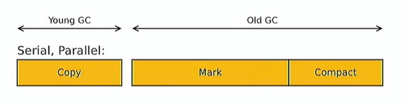
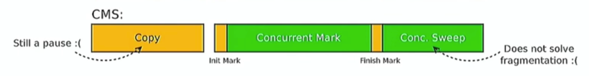

# Лабораторная работа 4: 

1. Мониторинг и профилирование. Основные понятия. Отличия мониторинга от профилирования.
2. Инфраструктура для организации мониторинга и профилирования в составе JDK. JMX.
3. MBeans. Основные понятия. Архитектура фреймворка.
4. Утилита JConsole. Возможности, область применения.
5. Утилита Visual VM. Возможности, область применения.
6. Удалённый мониторинг и профилирование приложений на платформе Java.

# Трофейные вопросы

## Vm stat, iostat, Sysstat, Pref

- **vmstat** показывает информацию о процессах, памяти, страницах, I/O, и о работе процессора. Пользователи vmstat могут указать интервал дискретизации, который дает возможность наблюдать работу системы в близком к реальному времени.
- **iostat** — утилита, предназначенная для мониторинга использования дисковых разделов, входящая в набор sysstat.
- **sysstat** — удобная утилита для измерения и анализа производительности системы. Можно получить доступ к системным характеристикам
- **Sysstat** включает в себя следующие утилиты:
    - **sar** — утилита для просмотра системных характеристик, логирование осуществляется с помощью бэкенда sadc
    - **sadf** — генерирует отчеты sar в формате CSV или XML
    - **iostat** — статистика ввода/вывода
    - **mpstat** — статистика CPU
    - **pidstat** — статистика по PID процесса.
- **Pref** это утилита для профилирования

## Сборщик мусора в Java, сколько?

[Доклад](https://youtu.be/ZYiQCHxgABI?t=273)

[Цикл статей про Garbage Collector в Java. Habr](https://habr.com/ru/post/269621/)

### Стратегии поиска мусора
В Java используется `метод обхода графа` достижимых объектов (**tracing**). 
Также есть `метод подсчета ссылок`, но он **не используется** 
т.к не выявляет циклические зависимости 
(Объект А ссылается на объект В, объект В ссылается на объект А, 
вместе они живут долго и счастливо).

- `tracing` : формирует набор корневых ссылок (root) из 
статических переменных и локальных (а также из ссылок из стеков потоков и 
ссылок из JNI - но лучше об этом не говорить). Все объекты, до которых нельзя 
дойти по корневым ссылкам и ссылкам их детей - мусор.

GC в Hotspot JVM:
- SerialGC
  - последовательная сборка молодого и старого поколения
- ParallelGC
  - максимальный throughput
  - параллельная сборка молодого и старого поколений

Оранжевое — программа под паузой

- CMS (Copy Mark Sweep)
  - предсказуемость
  - сборка в фоновом режиме (по возможности)
  - более низкие паузы по сравнению с Parallel и Serial
  - Sweep и Mark работают параллельно с приложением, но Sweep не перемещает объекты
  
Concurrent относится к олду - Mark и Sweep

- G1
  - предсказуемость
  - слабо подвержен фрагментации
  - в олде Compact под паузой (не перемещает объекты параллельно с приложением)
  - \+ может контроллировать эту паузу
  - регионализованный коллектор

## Как происходит сборка мусора

### Как найти мусор?

> Чтобы найти мусор, нужно ~~думать как мусор~~ узнать, есть ли ссылки на объект

Три подхода:
1. **No-op**: забить и считать все достижимым
2. **Mark-***: Пробежаться по графу объектов, найти достижимое и посчитать все остальное мусором
3. **Reference counting**: на каждом чтении/записи считать количество ссылок на объект; при refcount=0 считать объект мусором

Проблема циклов в 3 решает дерево 2

## JMX. Что такое? Какие проблемы решает

Это средство управления.
Сбор и оповещение, сбор и сохранение данных о приложении

## Профилировщики: Какие бывают? Зачем нужны

Профилирование - сбор характеристик работы программы, таких как время выполнения отдельных фрагментов 
(обычно подпрограмм), число верно предсказанных условных переходов, число кэш-промахов и т. д.

## Профилирование и мониторинг: в чем разница

Профилирование - узкий мониторинг по сути.

## Dynamic MBean и MBean

[Почитать](https://docs.oracle.com/cd/E19206-01/816-4178/6madjde4b/index.html)

Стандартная mbean имеет фиксированные метаданные, которые не изменяются в течение жизни MBean. Динамические MBeans 
определяют свои метаданные "на лету" и могут изменять и повторно публиковать свои метаданные

- standart
- dynamic
  - open - передаем только примитивы
  - model - все остальное, рефлексия

динамичные: используй этот метод. Можем передавать ключ

## Profiling
семплинг - какие функции больше всего по времени работаю.
Постоянно собираем стек трейс и по итогу смотрим что больше всего работало.

инструментальный - преобразуем программу таким образом, чтобы программа выдавала кучу мета-данных (visual vm так и работает)
- замедляет работу системы
- позволяет выдавать больше информации

