# Рубежка ...

Задания можно посмотреть в разделе [img_rubej](img_rubej)

## 1 вариант

1. Рисунок. Use-case диаграмма
2. Что предложил Ройс в своей модели
3. Разработать тестовой покрытие (рисунок)
4. Ресурсные риски
5. Экспозиция рисков
6. git pull. Что выполняет?
7. Команды git (рисунок)
8. Классификация жизненных ситуаций цикла ПО
9. Gradle скрипт для сборки
10. Анализ эквивалентности 
11. Отказоустойчивость системы
12. Скорость работы программы (Пирамида памяти)

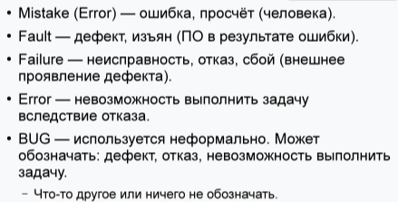

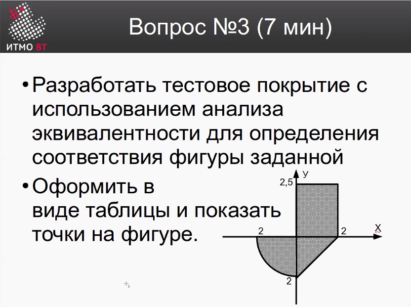
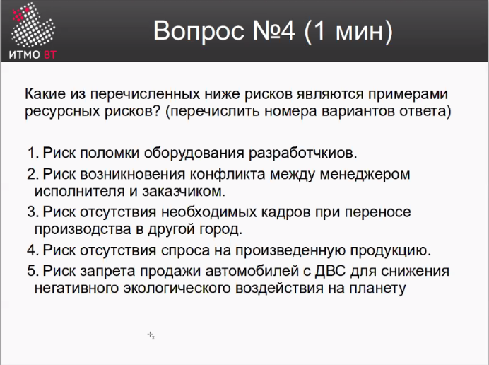
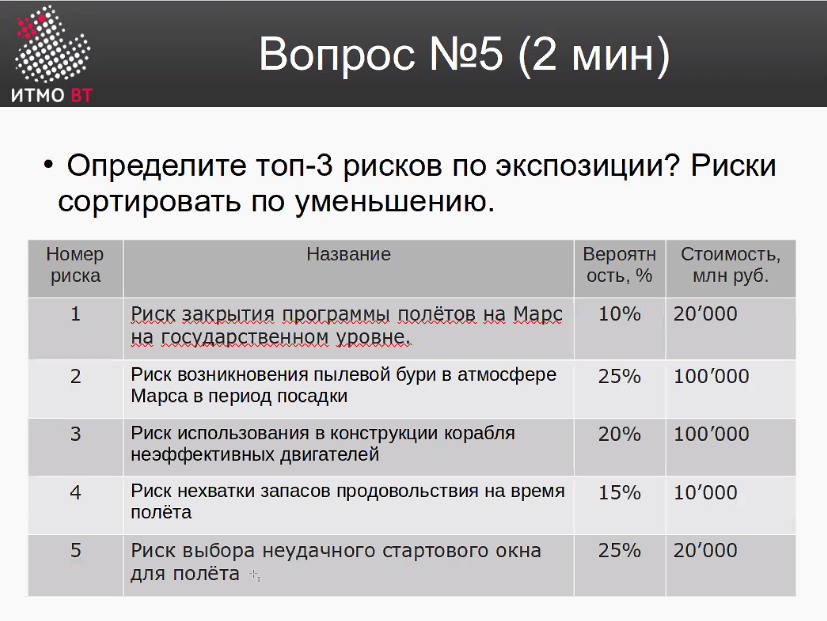
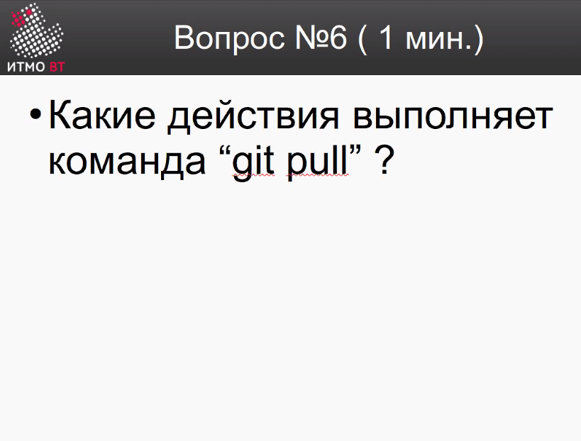
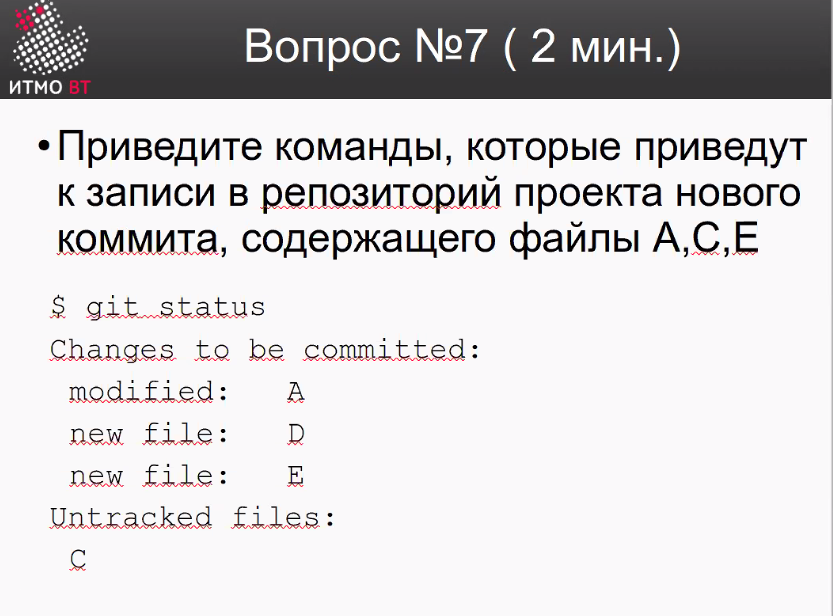

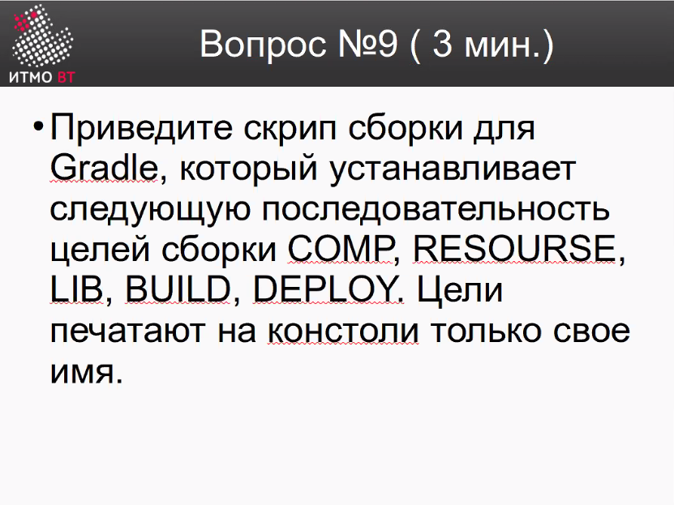
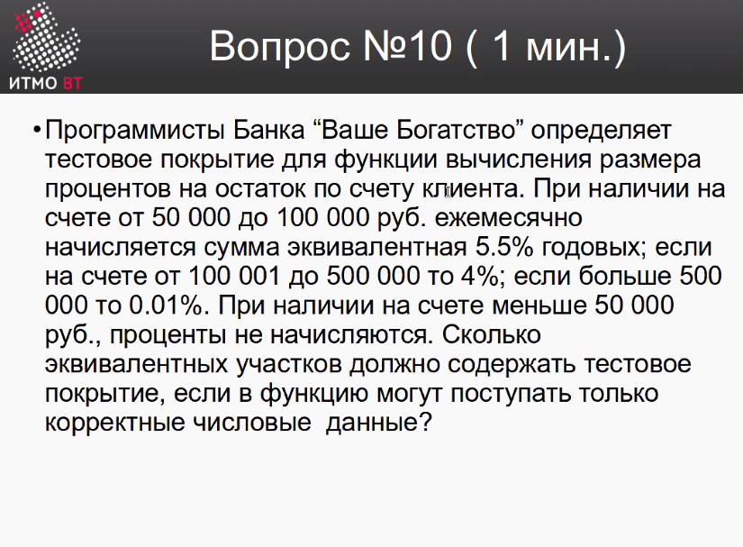
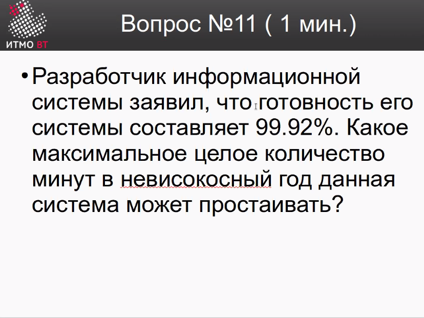
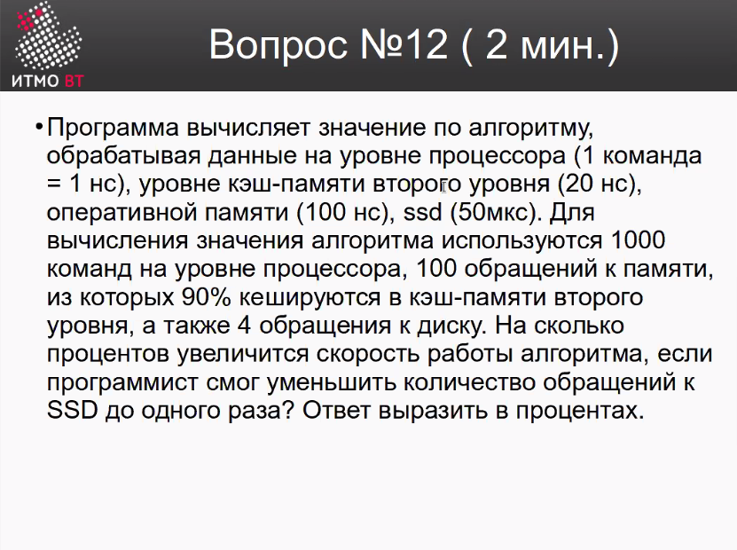

## 2 вариант

1. Доменная модель 
2. Чему уделялось внимание в спиральной модели
3. Разработать тестовое покрытие (рисунок)
4.
5. Экспозиция рисков
6. git rebase
7.
8.
9. makefile. Написать скрипт сборки
10. 

## Перепись

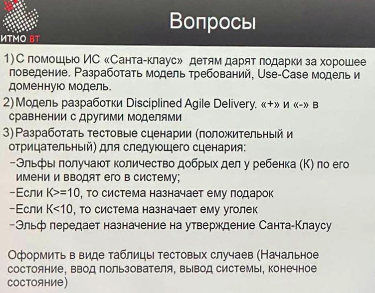

## Ответы

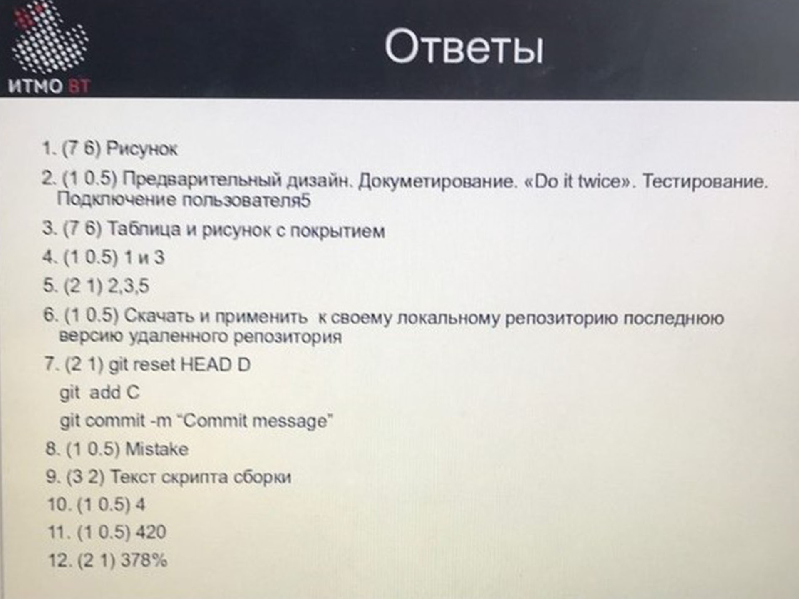
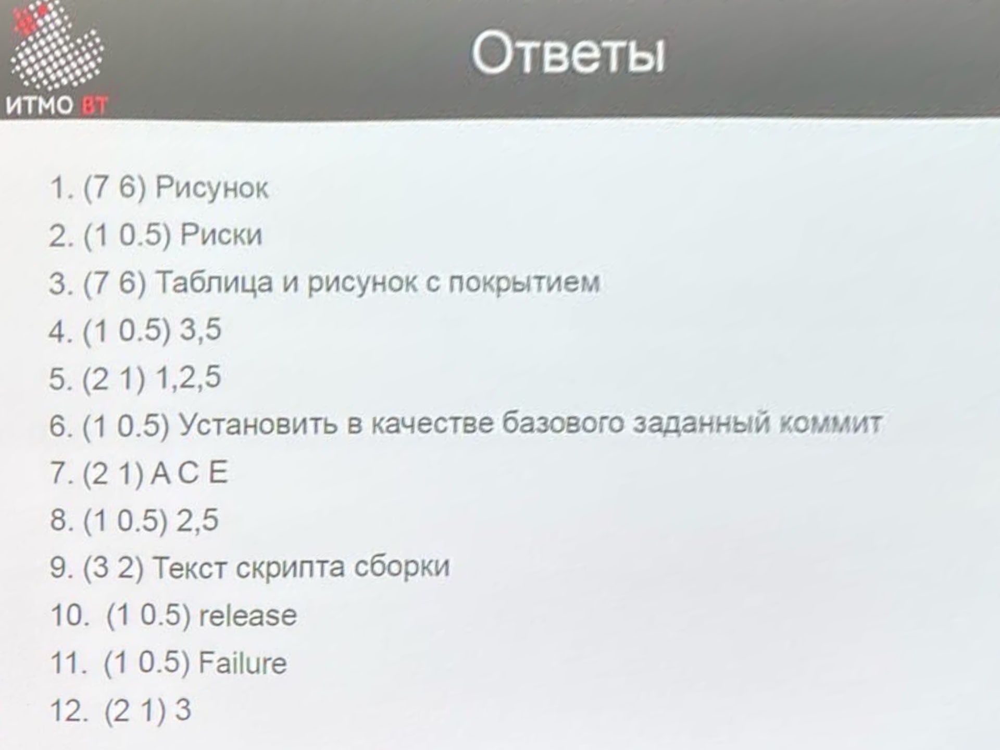

