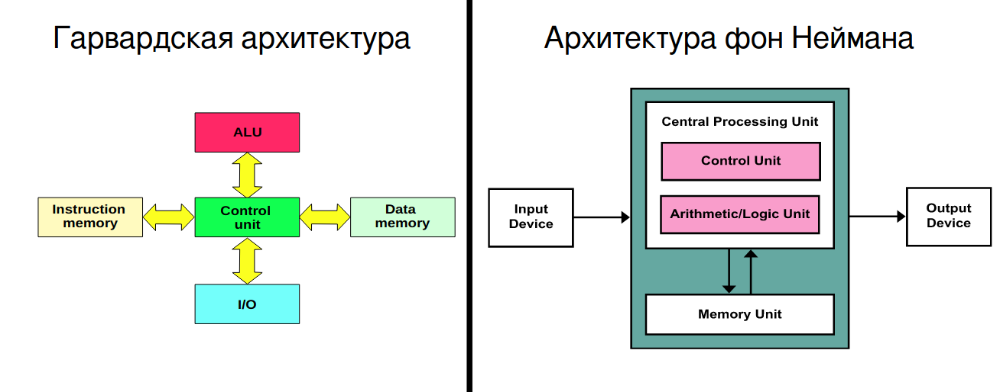
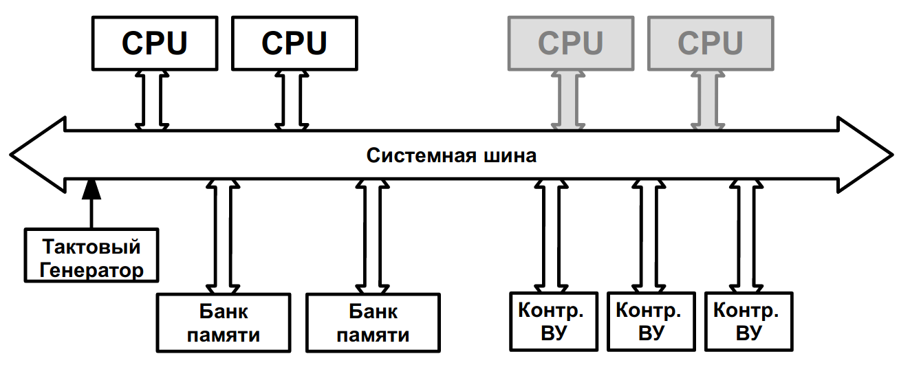
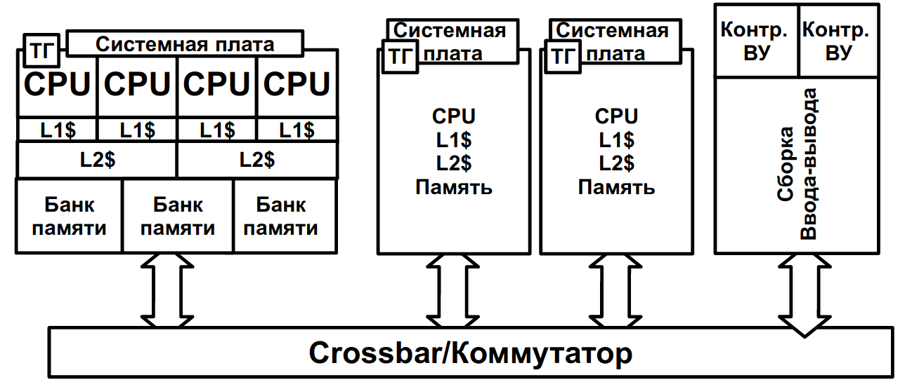
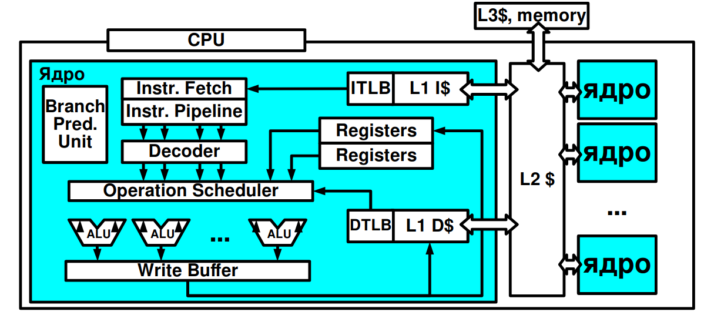

# [ОС #1-1. Архитектура компьютерных систем.](https://www.youtube.com/watch?v=NctMiqgVRxA&list=PLBWafxh1dFuyGGcWXmR_EngRkoUWvDFJi&index=1)

### `1:00` - Две основных архитектуры компьютерных систем

- Control Unit - Управляющее устройство
- ALU

### `2:44` - Основные черты архитектуры фон Неймана

- Принцип однородности памяти
  - Команды и данные хранятся в одной и той же памяти (внешне неразличимы)
- Принцип адресности
  - Память состоит из пронумерованных ячеек
  - Процессору доступна любая ячейка
- Принцип программного управления
  - Вычисления представлены в виду программы, состоящей из послудовательности команд
- Принцип двоичного кодирования
  - Всё есть 0 и 1
  
### `7:05` - UMA - Uniform Memory Access

В фон Неймановской архитектуре все строиться вокруг памяти. Когда ВМ осуществляет доступ к памяти, выбирая либо данные, либо команды в арх UMA подразумевается, что все устройства одноранговые. 

Все устройства подключены к одной шине, и процессору нужно пройти столько же системных вызовов, сколько и контроллеру ВУ.

Если добавить еще процессор, то процессоры станут конкурировать за общую память.

При этом в случае двух процессоров это не очень страшно. Современные архитектуры предполагают наличие кэша у процессора для сокращения обращений к оперативной памяти 

При наличии больше 4х процессоров (обычно с 2 ядрами) UMA перестает хорошо работать.

| Плюсы | Минусы |
|:---|:---|
| Удобство одноранговости - задержки одинаковые | Малая возможность к горизонтальному [масштабированию](https://habr.com/ru/company/oleg-bunin/blog/319526/) |

### `12:38` - NUMA - Non Uniform Memory Access

Системные ресурсы собраны в системные платы.

Crossbar/Коммутатор - устройство из нескольких портов шины, по которым общаются системные платы или сборки ввода-вывода и каждый порт может общаться с каждым.
- Помогает организоваться параллельное общение нескольких устройств без конфликтов.

Адресное пространство является общим для всех процессоров. Любой процесс будет видеть все банки памяти -> процесс может замаппить не туда данные.
- Пример: нужно быть готовым к тому, что даже проход по массиву может работать до половины быстро, а после медленно. Тому может быть причиной хранение первой половины массива локально, а обращение к остальной части через шину.

| Плюсы | Минусы |
|:---|:---|
| Горячая замена системных плат | Это доп требования к ОС |
| Отказоустойчивость и надежность |  |

# [ОС #1-2. Обзор элементов компьютерных систем](https://www.youtube.com/watch?v=tvNH0GyNywY&list=PLBWafxh1dFuyGGcWXmR_EngRkoUWvDFJi&index=2)

### `0:15` - Устройство процессора

- Крупноблочная архитектура (в большинстве процессоров)
- Процессор состоит из ядер, связанных L2$
- L2$ соединен с L1$
- L1$I отвечает за инструкции, L1$D - данные
  - У каждого свой TLB (Translation lookaside buffer — технология, оптимизирующая преобразование виртуальных адресов в физические - буфер ассоциативной трансляции)
    - Ускоряет поиск данных
    - в кэш попадает целиком строка, содержащая данные по нужному адресу. Если нам нужно воспользоваться в дальнейшем ближайшими ячейками, это ускоряет работу

4-50 останова