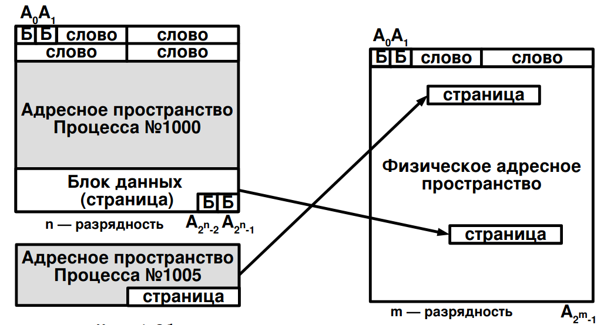
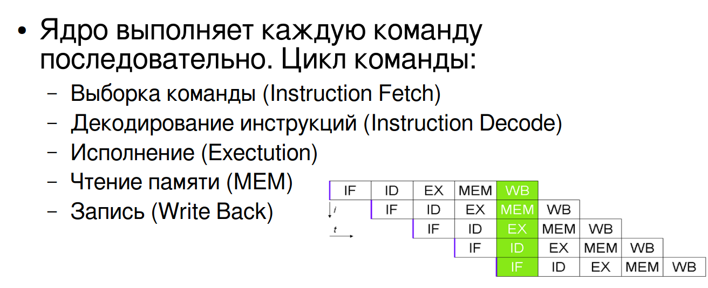
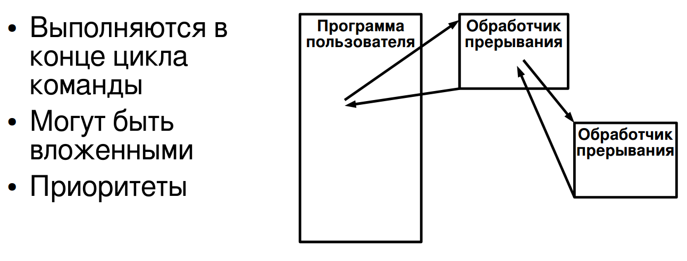
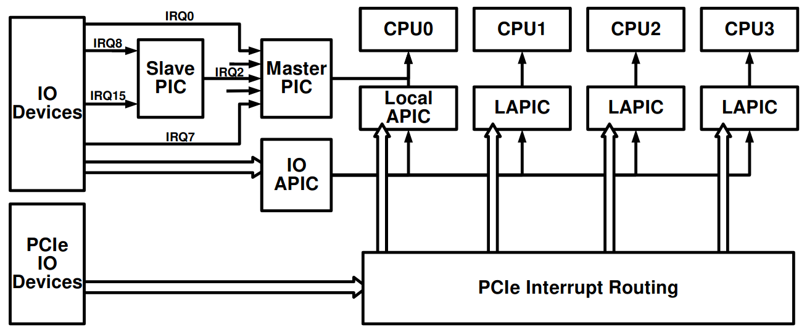
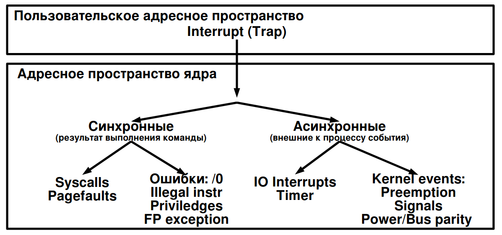
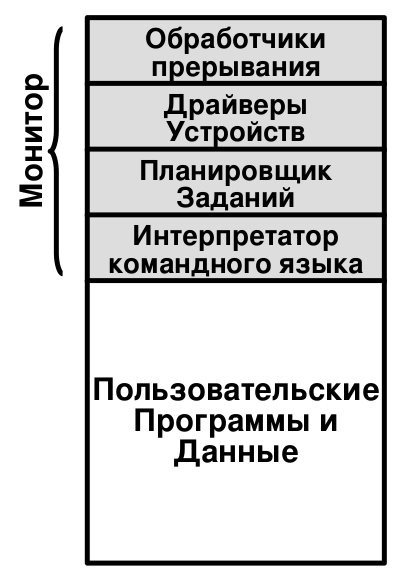
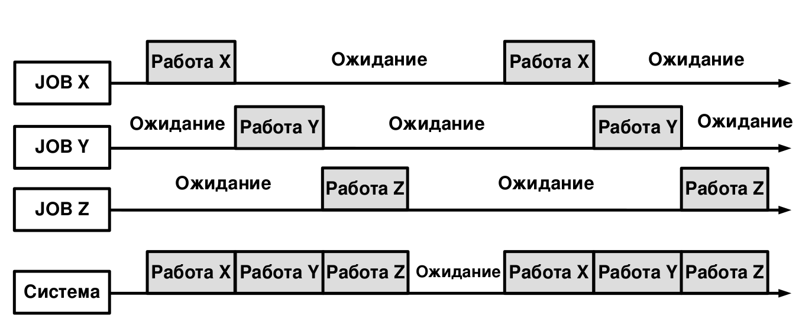

# [ОС #1-1. Архитектура компьютерных систем.](https://www.youtube.com/watch?v=NctMiqgVRxA&list=PLBWafxh1dFuyGGcWXmR_EngRkoUWvDFJi&index=1)

### `1:00` - Две основных архитектуры компьютерных систем

- Control Unit - Управляющее устройство
- ALU

### `2:44` - Основные черты архитектуры фон Неймана

- Принцип однородности памяти
  - Команды и данные хранятся в одной и той же памяти (внешне неразличимы)
- Принцип адресности
  - Память состоит из пронумерованных ячеек
  - Процессору доступна любая ячейка
- Принцип программного управления
  - Вычисления представлены в виду программы, состоящей из послудовательности команд
- Принцип двоичного кодирования
  - Всё есть 0 и 1
  
### `7:05` - UMA - Uniform Memory Access

В фон Неймановской архитектуре все строиться вокруг памяти. Когда ВМ осуществляет доступ к памяти, выбирая либо данные, либо команды в арх UMA подразумевается, что все устройства одноранговые. 

Все устройства подключены к одной шине, и процессору нужно пройти столько же системных вызовов, сколько и контроллеру ВУ.

Если добавить еще процессор, то процессоры станут конкурировать за общую память.

При этом в случае двух процессоров это не очень страшно. Современные архитектуры предполагают наличие кэша у процессора для сокращения обращений к оперативной памяти 

При наличии больше 4х процессоров (обычно с 2 ядрами) UMA перестает хорошо работать.

| Плюсы | Минусы |
|:---|:---|
| Удобство одноранговости - задержки одинаковые | Малая возможность к горизонтальному [масштабированию](https://habr.com/ru/company/oleg-bunin/blog/319526/) |

### `12:38` - NUMA - Non Uniform Memory Access

Системные ресурсы собраны в системные платы.

Crossbar/Коммутатор - устройство из нескольких портов шины, по которым общаются системные платы или сборки ввода-вывода и каждый порт может общаться с каждым.
- Помогает организоваться параллельное общение нескольких устройств без конфликтов.

Адресное пространство является общим для всех процессоров. Любой процесс будет видеть все банки памяти -> процесс может замаппить не туда данные.
- Пример: нужно быть готовым к тому, что даже проход по массиву может работать до половины быстро, а после медленно. Тому может быть причиной хранение первой половины массива локально, а обращение к остальной части через шину.

| Плюсы | Минусы |
|:---|:---|
| Горячая замена системных плат | Это доп требования к ОС |
| Отказоустойчивость и надежность |  |

# [ОС #1-2. Обзор элементов компьютерных систем](https://www.youtube.com/watch?v=tvNH0GyNywY&list=PLBWafxh1dFuyGGcWXmR_EngRkoUWvDFJi&index=2)

### `0:15` - Устройство процессора

- Крупноблочная архитектура (в большинстве процессоров)
- Процессор состоит из ядер, связанных L2$
- L2$ соединен с L1$
- L1$I отвечает за инструкции, L1$D - данные
- У каждого свой TLB (Translation lookaside buffer — технология, оптимизирующая преобразование виртуальных адресов в физические - буфер ассоциативной трансляции)
    - Ускоряет поиск данных (трансляцию адреса виртуальной памяти)
    - в кэш попадает целиком строка, содержащая данные по нужному адресу. Если нам нужно воспользоваться в дальнейшем ближайшими ячейками, это ускоряет работу
- Instruction Pipeline `6:00` - Конвейер:
- Инструкции не могут выполняться последовательно.
- Цикл выборки и распределения инструкций - смесь
- Параллелится очередь операций
- Branch Prediction Unit `11:25` - Предсказатель переходов
- Write Buffer `12:53`

### `9:00` - Hyperthreading

- Гипертрейдинг может создать ложное впечатление о производительности системы. Нужно понимать сколько реальных ядер в системе

### `14:35` - Организация памяти

TODO: Расписать механизм работы виртуальной памяти. 

Очень умное гейство. Красиво маппятся таблицы. Есть LP - Large Pages, которые заменяют несколько маленьких, чтобы удобнее было.

### `20:30` - Пирамида памяти

- CPU : самая быстрая и самая дорогая память
- L1 : практически на скорости процессора. Находится максимально близко к ядрам процессора
- L2, L3 : тоже находятся внутри процессора.
- RAM : бОльшее время доступа, но и внушительный объем.
- SSD : Существенно медленнее оперативной памяти. Условно в 1000 раз медленнее
- HDD : Еще примерно в 1000 раз медленнее

- Компилятор может включать различные уровни оптимизации, поэтому ему нужно управление регистровой памятью процессора

| Память | Возможности |
|:---|:---|
| Регистровая | Регистры процессора (физическая штука) |
| Ассоциативная | Память, адресуемая по содержимому |
| Блочная | Можем получить информацию только минимальным блоком (обычно 4КБ/совпадет с размером страницы в ОС) |
| | Даже если захотим прочитать байт, загрузится все равно блок данных (4КБ) |
| Последовательная ||

### `35:20` - Организация вычислений

Ускоряем работу процессора за счет разнесения работы конвейера.

### `38:50` - Прерывания

Это Временное приостановление работы программы + переход к обработчику прерывания

Могут быть вызваны:
- программно (вами)
- внешними устройствами - для обмена данными

### `42:07` - Контроллер прерываний x64

Статьи: 
- Прерывания от внешних устройств в системе x86. Хабр
- [Часть 1. Эволюция контроллеров прерываний](https://habr.com/ru/post/430548/)
- [Часть 2. Опции загрузки ядра Linux](https://habr.com/ru/post/431372/)

### `45:25` - Типы прерываний

Главное в ловушках — переключение контекста

# [ОС #1-3. Общие сведения об операционных системах](https://www.youtube.com/watch?v=5COHhO7Wp5o&list=PLBWafxh1dFuyGGcWXmR_EngRkoUWvDFJi&index=4)

### `00:00` - Типичные функции ОС

- Разработка программ
- Выполнение программ
- Доступ к устройствам ввода-вывода
  - ОС воспринимает все устройства как ресурсы, которыми она может "делиться" с пользователями согласно групповой политике
- Контролируемый доступ к файлам
- Доступ к системе и системным ресурсам
- Обнаружение и обработка ошибок
  - Если произошел Segmentation Fault или другие ошибки, ОС должна сохранить дамп памяти, любые файлы, по которым можно понять, что случилось, чтобы знать как решать проблему
- Учет использования и диспетчеризация ресурсов
  - По сути основная функция ОС.
  - Нужно посчитать все. что подключено, пронумеровать, понять какие права имеют, выдать другим потребителям
- Предоставление ключевых интерфейсов ОС:
  - ISA (Instruction Set Architecture) — Набор команд
  - ABI (Application Binary Interface) — Бинарный интерфейс приложения
  - API (Application Programming Interface) — Интерфейс прикладных программ

### `10:25` - Последовательная обработка. Оператор. (Экскурс в историю)

- В первых ЭВМ был только пульт управления
- Оператор должен был:
  - Получить программу с данными от программиста 
  - подготовить программу к загрузке (например с перфокарт)
  - загрузить программу и компилятор
  - запустить программу на вычисление 
  - распечатку с результатом передать программисту
- Минусы:
  - Наличие расписания машинного времени
  - Долгое время подготовки к работе
  
`14:02` - Пакетная обработка. Системный монитор 

- Машинное время дорогое, его было необходимо минимизировать
- 1950 - General Motors, IBM 701
- Наборы программ и данных передавались оператору и запускались

### `17:20` - Обще-системная эффективность 

Одно задание плохо загружает CPU:
- Read (15 мкс) → Compute 100 instr (1 мкс) → Write (15 мкс)
- Общая загрузка CPU ~ 3.2%

Давайте запустим много задач, и пока одни занимаются вводом-выводом, другие будут производить вычисления

### `19:00` - Многозадачность

"Ожидание" здесь значит мы можем заниматься вводом-выводом. 

### `21:20` - Системы разделения времени (Time sharing)

Основное назначение - не "деление", а совместное использование ресурсов.

Хорошо бы исключить оператора и добавить пользователей!
- Посадим юзеров за терминалы, пусть сами работают
- Будем выдавать им часть времени процессора с использованием квантования времени (time slices)

CTSS (CompatibleTime-Sharing System), MIT 1961, IBM 709
- Выгрузка и загрузка задач
- 32 пользователя

Появились проблемы разделения ресурсов и защиты одних программ от других